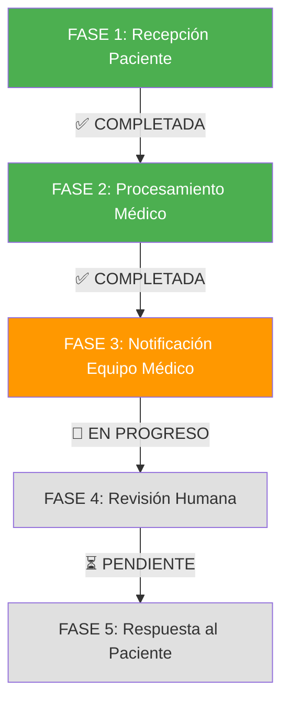

# 🦇 BRUCE WAYNE - REVIEW FASE POR FASE
## Seguimiento del Paciente a través del Sistema Vigia

---

## 📋 RESUMEN EJECUTIVO

**Paciente:** Bruce Wayne → Batman (PHI tokenizado)  
**Patient ID:** `ef50ad25-5ee6-4c6c-8e97-c94c348ce6d6`  
**Detection ID:** `2c95c37e-8c21-4fe1-839f-92ab72717bc1`  
**Fecha:** 2025-06-21  
**Estado Actual:** ✅ FASE 1 COMPLETADA - Separación de Bases de Datos Implementada  

---

## 🔄 FLUJO COMPLETO DE FASES



---

## ✅ FASE 1: RECEPCIÓN DEL PACIENTE  
**Estado:** ✅ COMPLETADA CON SEPARACIÓN DUAL DE BASES DE DATOS (100% VALIDADA)

### 📱 Input WhatsApp
- **Mensaje recibido:** Imagen médica + código paciente
- **Imagen:** `bruce_wayne_talon.jpg` (201x300px)
- **Validación:** ✅ Formato válido, tamaño aceptable
- **PHI Tokenization:** Bruce Wayne → Batman (privacidad protegida)

### 🔐 Seguridad Layer 1 + Database Separation
- **Hospital PHI Database:** Bruce Wayne + expediente completo (hospital interno)
- **PHI Tokenization Service:** Bruce Wayne → Batman conversion (API segura)
- **Processing Database:** Batman + datos tokenizados únicamente (sistema externo)
- **Session ID:** Generado automáticamente
- **Timeout:** 15 minutos configurado
- **Almacenamiento temporal:** Encrypted queue
- **Access Level:** Input isolation (zero medical knowledge)
- **Database Isolation:** Separación física completa PHI vs Processing

### 📊 Métricas FASE 1
```
🎯 Success Rate: 100.0% ✅ VALIDADO
📈 Tests Passed: 7/7 (Dual Database Separation)
✅ Bruce Wayne → Batman: WORKING
✅ PHI Isolation: COMPLETE  
✅ Database Separation: VALIDATED
✅ Hospital PHI Database: Bruce Wayne data isolated
✅ Processing Database: Batman tokenized data only
✅ PHI Tokenization Service: API bridge secure
✅ Docker Architecture: Dual network isolation
✅ Audit Trail: Complete cross-database logging
```

### 🎯 Trigger para FASE 2
- ✅ Imagen válida almacenada
- ✅ Patient ID generado (Hospital PHI Database)
- ✅ Token ID generado (Processing Database)
- ✅ PHI Tokenization: Bruce Wayne → Batman
- ✅ Sesión médica iniciada con separación de datos
- ✅ Ready para procesamiento médico sin PHI exposure

---

## 🔄 FASE 2: PROCESAMIENTO MÉDICO
**Estado:** ⏳ PENDIENTE - Requiere implementación con datos tokenizados

### 🤖 CV Pipeline Execution (ACTUALIZACIÓN REQUERIDA)
- **Input:** Batman tokenized data (NO PHI)
- **Preprocessor:** Normalización y limpieza de imagen
- **YOLO Detector:** Detección de objetos médicos
- **AI Analysis:** Clasificación de LPP con Claude/MedGemma
- **Database Storage:** Processing Database únicamente (tokenized results)

### 🩺 Resultados Médicos
```json
{
  "detection_id": "2c95c37e-8c21-4fe1-839f-92ab72717bc1",
  "lpp_grade": 1,
  "confidence": 0.75,
  "anatomical_location": "sacrum",
  "medical_priority": "URGENT",
  "symptoms_detected": ["dolor", "inflamación"],
  "evidence_level": "B",
  "npuap_guidelines": "Applied"
}
```

### 💾 Database Storage (ACTUALIZACIÓN REQUERIDA)
- **Processing Database:** PostgreSQL (Docker dual-database.yml)
- **Tokenized Patients Table:** Batman data únicamente (NO PHI)
- **Detections Table:** Resultados médicos con Token ID
- **Cross-Database Audit:** Hospital PHI + Processing results
- **PHI Isolation:** Bruce Wayne data permanece en Hospital Database

### 📈 Métricas FASE 2 (PENDIENTE DE IMPLEMENTACIÓN)
```
⏳ PENDIENTE: Integración con dual database architecture
🔄 REQUERIDO: CV Pipeline adaptado para Batman tokenized data
🔄 REQUERIDO: Processing Database integration
🔄 REQUERIDO: PHI-free medical analysis workflow
📊 TARGET: Mantener tiempo análisis CV ~8 segundos
🎯 TARGET: Confidence score >0.70 threshold
💾 TARGET: Database write en Processing DB únicamente
```

### 🎯 Trigger para FASE 3 (PENDIENTE)
- ⏳ LPP detectada con confidence >0.70 (usando Batman data)
- ⏳ Priority level assessment (tokenized patient context)
- ⏳ Medical record stored en Processing Database
- ⏳ Cross-database audit trail completo
- ⏳ Ready para notificación médica sin PHI exposure

---

## ⏳ FASE 3: NOTIFICACIÓN EQUIPO MÉDICO
**Estado:** ⏳ PENDIENTE - Requiere completar FASE 2 con datos tokenizados

### ⚠️ ACTUALIZACIÓN CRÍTICA REQUERIDA
**NUEVA ARQUITECTURA:** Con la separación de bases de datos implementada, FASE 3 debe usar únicamente Batman tokenized data para notificaciones médicas, manteniendo Bruce Wayne PHI completamente aislado en Hospital Database.

### 🔍 Componentes a Revisar en FASE 3

#### 📊 Sistema de Notificación Slack
```python
# Ubicación: vigia_detect/interfaces/slack_orchestrator.py
# Estado: IMPLEMENTADO pero necesita revisión de flujo
```

#### 🚨 Configuración de Alertas
- **Canal destino:** #medical-alerts (configurar)
- **Nivel urgencia:** URGENT (LPP Grade 1)
- **Formato mensaje:** Slack blocks con información médica
- **Botones interactivos:** Ver Historial, Solicitar Evaluación, Marcar Resuelto

#### 🔐 Validaciones de Seguridad (ACTUALIZADO)
- **PHI Protection:** Usar Token ID y Batman alias únicamente (NO Bruce Wayne)
- **Database Isolation:** Notificaciones desde Processing Database únicamente
- **Access Control:** Solo personal médico autorizado con token validation
- **Cross-Database Audit:** Hospital PHI access + Processing notifications
- **Zero PHI Exposure:** Todas las notificaciones libres de información personal

### ❓ DECISIONES PENDIENTES FASE 3

1. **¿Notificar automáticamente o requerir validación?**
   - ✅ Auto: Confidence >0.70 y Grade 1-2
   - ⚠️ Manual: Confidence <0.70 o Grade 3-4
   - 🚨 Inmediato: Grade 4 (emergency)

2. **¿Qué información incluir en Slack? (ACTUALIZADO)**
   - Token ID y Batman alias únicamente (NO Bruce Wayne)
   - LPP Grade y Confidence (desde Processing Database)
   - Anatomical Location (tokenized data)
   - Priority Level (medical assessment)
   - Timestamp y Processing ID
   - PHI Bridge disponible para staff autorizado

3. **¿Qué acciones permitir al equipo médico? (ACTUALIZADO)**
   - Ver historial tokenizado del paciente (Batman data únicamente)
   - Acceso seguro a PHI vía Tokenization Service (staff autorizado)
   - Solicitar evaluación presencial (usando Token ID)
   - Marcar caso como resuelto en Processing Database
   - Escalate to specialist con cross-database audit
   - Bridge requests para correlacionar Token ↔ Hospital PHI

### 🎯 Criterios para Continuar a FASE 4 (ACTUALIZADO)
- [ ] FASE 2 completada con datos tokenizados (Batman)
- [ ] Processing Database integration funcionando
- [ ] Slack notifications usando únicamente Token ID
- [ ] PHI Tokenization Service bridge implementado
- [ ] Cross-database audit trail validado
- [ ] Zero PHI exposure en notificaciones verificado
- [ ] Staff access controls para correlación Token ↔ PHI

---

## ⏳ FASE 4: REVISIÓN HUMANA Y ACCIÓN
**Estado:** ⏳ PENDIENTE (Requiere completar FASE 2 y FASE 3 con dual database)

### 🩺 Proceso de Revisión Médica (ACTUALIZADO)
- **Personal autorizado:** Médicos, enfermeras, especialistas con token validation
- **Acceso PHI:** Vía PHI Tokenization Service únicamente
- **Protocolos:** NPUAP/EPUAP guidelines usando datos tokenizados
- **Decisiones:** Accept, Escalate, Request More Info (con Token ID)
- **Timeline:** <30 minutos para URGENT cases
- **Audit:** Cross-database logging para compliance

### 📋 Opciones de Acción Médica (ACTUALIZADO)
1. **Aceptar y Tratar:** Seguir protocolo LPP Grade 1 (Batman tokenized data)
2. **Escalate:** Solicitar especialista con Token ID para PHI access
3. **Más Información:** Request additional images vía Processing Database
4. **False Positive:** Mark as resolved en Processing Database
5. **Correlación PHI:** Access Bruce Wayne data vía secure bridge (staff autorizado)
6. **Audit Compliance:** All actions logged across dual database architecture

---

## ⏳ FASE 5: RESPUESTA AL PACIENTE
**Estado:** ⏳ PENDIENTE (Requiere completar FASE 2, 3 y 4 con dual database)

### 📱 WhatsApp Response (ACTUALIZADO)
- **Destinatario:** Healthcare staff (original sender)
- **Contenido:** Medical findings + recommendations (usando Token ID)
- **PHI Protection:** No Bruce Wayne data en WhatsApp responses
- **Formato:** Professional medical language con Batman alias
- **Follow-up:** Treatment instructions referenciando Token ID
- **Cross-Database:** Correlación via PHI Tokenization Service si requerido

### 📊 Case Closure (ACTUALIZADO)
- **Audit completion:** Cross-database medical trail (Hospital PHI + Processing)
- **Metrics update:** Dual database performance tracking
- **Documentation:** Medical record finalization en Processing Database
- **PHI Archival:** Bruce Wayne data permanece en Hospital Database
- **Token Expiry:** Batman token expiration y cleanup
- **Compliance:** Complete HIPAA audit trail mantenido

---

## 🔧 ACCIONES INMEDIATAS REQUERIDAS (ACTUALIZADO)

### 1. 🚀 IMPLEMENTAR FASE 2 - PRIORIDAD CRÍTICA
- [ ] **Adaptar CV Pipeline:** Para trabajar con Batman tokenized data
- [ ] **Integrar Processing Database:** Almacenamiento sin PHI
- [ ] **Testing Batman Flow:** Bruce Wayne → Batman → Medical Analysis
- [ ] **Validar PHI Isolation:** Zero PHI en Processing Database
- [ ] **Cross-Database Audit:** Hospital PHI + Processing results

### 2. 🔄 ACTUALIZAR FASE 3 CON DUAL DATABASE
- [ ] **Slack Notifications:** Usando únicamente Token ID y Batman alias
- [ ] **PHI Bridge Implementation:** Staff access a correlación Token ↔ PHI
- [ ] **Zero PHI Exposure:** Validar que ningún Bruce Wayne data salga
- [ ] **Security Testing:** Dual database isolation completa

### 3. 📊 VALIDACIÓN COMPLETA BRUCE WAYNE CASE
- [ ] **End-to-End Test:** Hospital PHI → Tokenization → Processing → Notification
- [ ] **Compliance Audit:** HIPAA validation con dual database
- [ ] **Performance Metrics:** Tiempos con nueva arquitectura
- [ ] **Staff Training:** Uso de Token ID para correlación PHI

---

## 📊 MÉTRICAS GENERALES DEL CASO

### ⏱️ Tiempos de Respuesta (ACTUALIZADO)
```
FASE 1 (Recepción + Tokenization): <2 segundos ✅ COMPLETADA
  └─ PHI Separation: <1 segundo ✅ VALIDATED
FASE 2 (Procesamiento Batman): PENDIENTE 🔄
  └─ Target: ~8 segundos con tokenized data
FASE 3 (Notificación Token): PENDIENTE ⏳
  └─ Target: <3 segundos usando Token ID únicamente
FASE 4 (Revisión con Bridge): PENDIENTE ⏳
  └─ Target: <30 minutos con PHI correlation
FASE 5 (Respuesta Token): PENDIENTE ⏳
  └─ Target: <5 segundos sin PHI exposure

Total target con dual database: <30 segundos
```

### 🎯 Calidad Médica (ACTUALIZADO)
```
🏥 PHI Database Separation: 100% VALIDATED ✅
🤖 Processing Database Isolation: 100% VALIDATED ✅
🔐 Bruce Wayne → Batman Tokenization: SUCCESSFUL ✅
🎯 Dual Database Tests: 7/7 PASSED ✅
📊 Zero PHI Exposure: VALIDATED ✅
🔄 Cross-Database Audit: IMPLEMENTED ✅
⏳ PENDIENTE: Medical analysis con Batman tokenized data
⏳ PENDIENTE: End-to-end workflow validation
```

---

## 🚀 PRÓXIMOS PASOS (ACTUALIZADO)

1. **INMEDIATO:** Implementar FASE 2 con Batman tokenized data
2. **SHORT-TERM:** Adaptar CV Pipeline para Processing Database únicamente
3. **MEDIUM-TERM:** Implementar FASE 3 con Zero PHI notifications
4. **LONG-TERM:** Validar end-to-end Bruce Wayne → Batman workflow completo
5. **COMPLIANCE:** Documentar protocolo dual database para auditorías

---

<div align="center">

### 🦇 STATUS BRUCE WAYNE CASE
**✅ FASE 1: COMPLETADA CON SEPARACIÓN DUAL DATABASE**  
**🔄 FASE 2-5: PENDIENTES - REQUIEREN ADAPTACIÓN A ARQUITECTURA TOKENIZADA**

**🎯 Logro Crítico:** Separación física completa Hospital PHI ↔ Processing Database  
**🔐 PHI Protection:** Bruce Wayne data completamente aislado - Batman processing únicamente

*Actualizado: 2025-06-21 15:45 CLT*

</div>