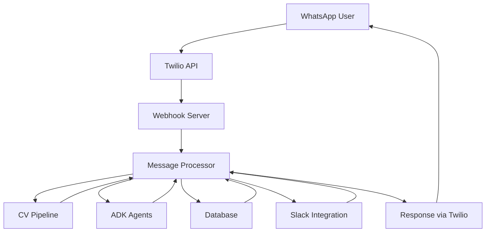

# Vigia Developer Guide

Comprehensive development guide for the medical-grade LPP (pressure injury) detection system using ADK architecture.

## Table of Contents

- [Project Overview](#project-overview)
- [Development Setup](#development-setup)
- [Architecture Overview](#architecture-overview)
- [Module Development](#module-development)
  - [CLI Module](#cli-module)
  - [CV Pipeline Module](#cv-pipeline-module)
  - [Messaging Module](#messaging-module)
  - [Database Module](#database-module)
- [Testing](#testing)
- [Code Style & Best Practices](#code-style--best-practices)
- [Troubleshooting](#troubleshooting)

## Project Overview

Vigia is a production-ready medical-grade pressure injury (LPP) detection system that implements:

- **ADK (Agent Development Kit) Architecture**: 5 specialized medical agents
- **Evidence-based Medical Decisions**: NPUAP/EPUAP/PPPIA 2019 guidelines
- **Local AI Processing**: MedGemma for HIPAA-compliant medical analysis
- **Real-time Communication**: WhatsApp/Slack integration with webhook processing
- **Regulatory Compliance**: HIPAA, ISO 13485, SOC2 ready

## Development Setup

### 1. Initial Environment Setup

```bash
# 1. Configure credentials securely
python scripts/setup_credentials.py
# Select option 1 and configure: Twilio, Anthropic, Supabase

# 2. Load credentials in your session
source scripts/quick_env_setup.sh

# 3. Install dependencies
pip install -r config/requirements.txt

# 4. Setup local medical AI
python scripts/setup_medgemma_ollama.py --install-ollama
python scripts/setup_medgemma_ollama.py --model 27b --install
```

### 2. Database Setup

```bash
# Setup Redis for medical protocol caching
python scripts/setup_redis_simple.py

# Test database connectivity
python examples/redis_integration_demo.py
```

### 3. Development Services

```bash
# Start async medical workers
./scripts/start_celery_worker.sh

# Start WhatsApp webhook server (development)
./start_whatsapp_server.sh

# Start Slack notification server
./scripts/start_slack_server.sh
```

## Architecture Overview

### ADK Agent System

The system uses 5 specialized medical agents inheriting from **BaseAgent**:

```python
# All agents follow this pattern
from vigia_detect.agents.base_agent import BaseAgent, AgentMessage, AgentResponse

class MedicalAgent(BaseAgent):
    def process_message(self, message: AgentMessage) -> AgentResponse:
        # Medical processing logic
        pass
```

**Core Agents:**
- **ImageAnalysisAgent** (`vigia_detect/agents/image_analysis_agent.py`): YOLOv5 LPP detection
- **ClinicalAssessmentAgent** (`vigia_detect/agents/clinical_assessment_agent.py`): Evidence-based medical decisions
- **ProtocolAgent** (`vigia_detect/agents/protocol_agent.py`): Medical protocol consultation
- **CommunicationAgent** (`vigia_detect/agents/communication_agent.py`): WhatsApp/Slack messaging
- **WorkflowOrchestrationAgent** (`vigia_detect/agents/workflow_orchestration_agent.py`): Medical workflow coordination

### A2A Distributed Infrastructure

Agent-to-Agent communication via JSON-RPC 2.0 (`vigia_detect/a2a/`):

```python
# Example A2A communication
from vigia_detect.a2a.protocol_layer import A2AProtocol
from vigia_detect.agents.base_agent import AgentMessage

protocol = A2AProtocol()
message = AgentMessage(
    message_id="msg_001",
    sender_id="clinical_agent",
    recipient_id="protocol_agent",
    message_type="protocol_query",
    content={"lpp_grade": 2, "location": "sacrum"}
)
response = await protocol.send_message(message)
```

### Asynchronous Medical Pipeline

Timeout-resistant processing (`vigia_detect/core/async_pipeline.py`):

```python
# Async medical task execution
from vigia_detect.tasks.medical import image_analysis_task

# 3-5 minute task limits vs 30-60 second blocking operations
result = image_analysis_task.delay(
    image_path="/path/to/image.jpg",
    patient_code="CD-2025-001",
    patient_context={'diabetes': True}
)
```

## Module Development

### CLI Module

**Location**: `vigia_detect/cli/`

**Structure**:
- `process_images_refactored.py`: Main CLI script with ADK integration
- `tests/`: Unit tests for CLI functionality

**Key Features**:
- Batch processing of medical images
- YOLOv5-based LPP detection (stages 0-4)
- Supabase/local filesystem storage
- Privacy protection (face blurring, EXIF removal)

**Adding New CLI Features**:

1. **Identify the requirement**: Define the new feature clearly
2. **Locate relevant code**: Find functions in `process_images_refactored.py`
3. **Implement logic**: Add feature with type hints and error handling
4. **Update argument parsing**: Modify `parse_args()` using `argparse`
5. **Integrate with main flow**: Connect to `main()` or `process_directory()`
6. **Write tests**: Create tests in `tests/test_cli.py`

**Example CLI Usage**:
```bash
# Process images with webhook integration
python vigia_detect/cli/process_images_refactored.py \
  --input /path/to/images \
  --webhook \
  --patient-code CD-2025-001
```

### CV Pipeline Module

**Location**: `vigia_detect/cv_pipeline/`

**Structure**:
- `detector.py`: `LPPDetector` class for YOLOv5 inference
- `preprocessor.py`: `ImagePreprocessor` for medical image transformations
- `tests/`: Unit tests with sample medical images

**Key Components**:

```python
# LPP Detection
from vigia_detect.cv_pipeline.detector import LPPDetector

detector = LPPDetector(
    model_type='yolov5s',
    conf_threshold=0.25,
    model_path='/path/to/medical_model.pt'
)

results = detector.detect('/path/to/medical_image.jpg')
# Returns: [{'stage': 2, 'confidence': 0.85, 'bbox': [...]}]
```

```python
# Image Preprocessing
from vigia_detect.cv_pipeline.preprocessor import ImagePreprocessor

preprocessor = ImagePreprocessor(
    target_size=(640, 640),
    remove_exif=True,
    blur_faces=True
)

processed_image = preprocessor.preprocess('/path/to/image.jpg')
```

**Medical Model Integration**:

1. **Obtain medical model weights**: Download YOLOv5-medical model
2. **Update `_load_model`**: Modify to load custom medical weights
3. **Verify class mapping**: Ensure LPP stages (0-4) map correctly
4. **Update tests**: Verify detection results with medical test images

### Messaging Module

**Location**: `vigia_detect/messaging/`

**Structure**:
- `twilio_client.py`: WhatsApp communication via Twilio
- `whatsapp/server.py`: Flask webhook server
- `whatsapp/processor.py`: Message processing and medical integration
- `templates/`: WhatsApp message templates
- `utils/`: Twilio utilities and validation

**Architecture Flow**:



**Medical Image Processing Workflow**:

1. User sends image via WhatsApp
2. Webhook validates and extracts image
3. Image downloaded to secure temporary storage
4. CV Pipeline analyzes for LPP detection
5. ADK agents interpret results with medical evidence
6. Appropriate template selected based on LPP stage
7. Response sent via WhatsApp
8. Medical staff notified via Slack if needed
9. Interaction logged for audit compliance

**WhatsApp Template Responses by LPP Stage**:

| LPP Stage | Response Template | Medical Action |
|-----------|------------------|----------------|
| No LPP | Informational message | Preventive guidance |
| Stage 1 | Low risk notification | Monitoring recommendations |
| Stage 2 | Moderate risk alert | Medical consultation suggested |
| Stage 3/4 | High risk emergency | Immediate medical attention |
| Invalid Image | Clarification request | Request better image |

**Adding New Messaging Features**:

1. **Define new template**: Add to `templates/whatsapp_templates.py`
2. **Extend processor logic**: Modify `whatsapp/processor.py`
3. **Integrate with ADK agents**: Connect to appropriate medical agents
4. **Add Slack notifications**: Configure internal alerts
5. **Update security validation**: Ensure PHI protection

### Database Module

**Location**: `vigia_detect/db/` and documented in `docs/database/`

**Key Features**:
- Supabase PostgreSQL integration
- Row-Level Security (RLS) policies
- JSONB fields for flexible medical data
- Audit logging for regulatory compliance
- Future FHIR compatibility

**Connection Setup**:

```python
import os
from supabase import create_client, Client
from dotenv import load_dotenv

load_dotenv()

supabase_url = os.getenv("SUPABASE_URL")
supabase_key = os.getenv("SUPABASE_KEY")
supabase: Client = create_client(supabase_url, supabase_key)

# Medical query example
response = supabase.table("clinical_data.patients").select("*").execute()
patients = response.data
```

**Medical Decision Integration**:

```python
# Evidence-based medical decisions
from vigia_detect.systems.medical_decision_engine import MedicalDecisionEngine
from vigia_detect.systems.minsal_medical_decision_engine import make_minsal_clinical_decision

# International guidelines (NPUAP/EPUAP)
engine = MedicalDecisionEngine()
decision = engine.make_clinical_decision(
    lpp_grade=2, 
    confidence=0.85, 
    anatomical_location="sacrum"
)

# Chilean regulatory compliance (MINSAL)
decision = make_minsal_clinical_decision(
    lpp_grade=2, 
    confidence=0.75,
    patient_context={'diabetes': True, 'public_healthcare': True}
)
```

## Testing

### Test Organization

```bash
# Run specific test categories
python -m pytest tests/unit/ -m unit           # Unit tests
python -m pytest tests/adk/ -m adk             # ADK agent tests  
python -m pytest tests/medical/ -m medical     # Medical validation
python -m pytest tests/integration/ -m integration  # Integration tests

# Critical validation tests
python -m pytest tests/medical/test_minsal_integration.py -v    # Chilean compliance
python -m pytest tests/adk/test_simple_adk_integration.py -v    # ADK integration
python -m pytest tests/integration/test_async_simple.py -v     # Async pipeline

# Skip slow tests during development
python -m pytest tests/ -m "not slow"
```

### Writing Medical Tests

```python
# Medical test example
import pytest
from vigia_detect.systems.medical_decision_engine import MedicalDecisionEngine

class TestMedicalDecisions:
    def test_stage_2_lpp_decision(self):
        engine = MedicalDecisionEngine()
        decision = engine.make_clinical_decision(
            lpp_grade=2,
            confidence=0.85,
            anatomical_location="sacrum"
        )
        
        assert decision.urgency_level == "moderate"
        assert "NPUAP" in decision.evidence_references
        assert decision.confidence >= 0.8
```

### Async Testing

```python
# Async pipeline testing
import pytest
from vigia_detect.tasks.medical import image_analysis_task

@pytest.mark.asyncio
async def test_async_medical_processing():
    result = await image_analysis_task.delay(
        image_path="tests/data/test_lpp_stage2.jpg",
        patient_code="TEST-001"
    )
    
    assert result.status == "completed"
    assert result.lpp_grade in [0, 1, 2, 3, 4]
```

## Code Style & Best Practices

### Medical Safety Requirements

1. **Evidence-based medicine**: All clinical logic must reference NPUAP/EPUAP/PPPIA 2019 guidelines
2. **Scientific justification**: Include evidence levels (A/B/C) with decisions
3. **Escalation protocols**: Low-confidence decisions automatically escalate to human review
4. **Complete audit trails**: Required for regulatory compliance

### Code Standards

```python
# Type hints required for medical functions
from typing import Dict, List, Optional, Union
from vigia_detect.types.medical import LPPGrade, ConfidenceScore

def analyze_medical_image(
    image_path: str,
    patient_context: Optional[Dict[str, Union[str, bool]]] = None
) -> Dict[str, Union[LPPGrade, ConfidenceScore, str]]:
    """
    Analyze medical image for LPP detection.
    
    Args:
        image_path: Path to medical image file
        patient_context: Optional patient risk factors
        
    Returns:
        Dictionary with LPP grade, confidence, and evidence
        
    Raises:
        MedicalProcessingError: If analysis fails
    """
    pass
```

### Error Handling

```python
# Medical error handling with escalation
try:
    result = analyze_lpp_image(image_path)
    if result.confidence < 0.7:
        # Automatic escalation for low confidence
        escalate_to_medical_review(result, patient_id)
except MedicalProcessingError as e:
    # Log medical errors for audit
    audit_logger.error(f"Medical analysis failed: {e}", 
                      extra={"patient_id": patient_id})
    raise
```

### Local AI Processing

```python
# Prefer MedGemma local processing for medical data
from vigia_detect.ai.medgemma_client import MedGemmaClient

# HIPAA-compliant local processing
medgemma = MedGemmaClient(local_only=True)
medical_analysis = medgemma.analyze_symptoms(
    symptoms=patient_symptoms,
    context=medical_context
)
```

## Troubleshooting

### Common Development Issues

**Import Errors After Refactoring**:
```bash
# Verify module structure
python -c "from vigia_detect.agents.image_analysis_agent import ImageAnalysisAgent"

# Check if running from correct directory
pwd  # Should be in /Users/autonomos_dev/Projects/vigia
```

**ADK Agent Communication Issues**:
```python
# Debug agent communication
import logging
logging.basicConfig(level=logging.DEBUG)

# Test agent instantiation
from vigia_detect.agents.clinical_assessment_agent import ClinicalAssessmentAgent
agent = ClinicalAssessmentAgent()
```

**Medical Decision Engine Errors**:
```bash
# Validate medical decision logic
python scripts/validate_post_refactor_simple.py --verbose

# Test MINSAL integration
python -m pytest tests/medical/test_minsal_integration.py -v
```

**Async Pipeline Issues**:
```bash
# Check Redis connectivity
redis-cli ping

# Verify Celery workers
./scripts/start_celery_worker.sh
```

**WhatsApp Webhook Issues**:
```bash
# Test webhook server locally
./start_whatsapp_server.sh

# Verify Twilio configuration
python -c "import os; print(os.getenv('TWILIO_ACCOUNT_SID'))"
```

### Medical Compliance Debugging

```python
# Audit medical decisions
from vigia_detect.systems.medical_decision_engine import MedicalDecisionEngine

engine = MedicalDecisionEngine()
decision = engine.make_clinical_decision(lpp_grade=2, confidence=0.75)

# Verify evidence references
assert "NPUAP" in decision.evidence_references
assert decision.evidence_level in ["A", "B", "C"]
print(f"Medical justification: {decision.justification}")
```

### Performance Optimization

```bash
# Monitor medical processing performance
python scripts/performance_monitor.py --component cv_pipeline

# Check async task queue status
celery -A vigia_detect.tasks inspect active
```

## Production Deployment

### Hospital Production Setup

```bash
# Full hospital deployment
./scripts/hospital-deploy.sh deploy

# Check services status
./scripts/hospital-deploy.sh status

# Monitor medical logs
./scripts/hospital-deploy.sh logs
```

### Medical AI Validation

```bash
# Validate MedGemma local setup
ollama run symptoma/medgemma3 "¿Cuáles son los grados de LPP?"

# Test medical protocol search
python examples/redis_integration_demo.py
```

For additional deployment details, see [HOSPITAL_DEPLOYMENT.md](deployment/HOSPITAL_DEPLOYMENT.md).

## Resources

- **Medical Guidelines**: [NPUAP/EPUAP Clinical Decisions](medical/NPUAP_EPUAP_CLINICAL_DECISIONS.md)
- **Chilean Compliance**: [MINSAL Integration](medical/minsal-integration.md)
- **API Reference**: [API_REFERENCE.md](API_REFERENCE.md)
- **Setup Guide**: [SETUP_GUIDE.md](SETUP_GUIDE.md)
- **Database Documentation**: [database/](database/)