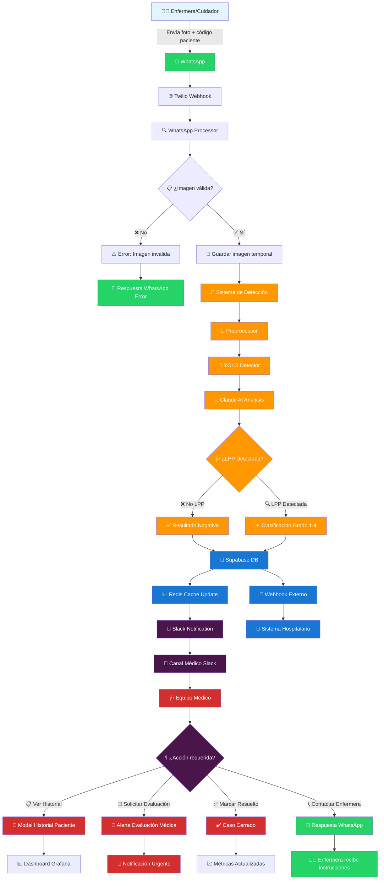
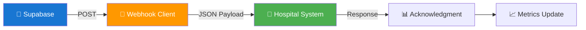

# 🏥 DIAGRAMA DE FLUJO - SISTEMA VIGÍA
## Flujo Completo: WhatsApp → Detección → Slack → Respuesta

---

## 🔄 FLUJO PRINCIPAL DE DATOS



---

## 🔍 DETALLE DE COMPONENTES

### 📱 **1. ENTRADA WHATSAPP**
```
Flujo: Enfermera → WhatsApp → Twilio → Vigia
├── 📸 Imagen LPP (JPG/PNG)
├── 🏷️ Código Paciente (CD-2025-001)
├── 📝 Mensaje opcional
└── 🔐 Validación formato
```

### 🤖 **2. PIPELINE DE DETECCIÓN**
```
vigia_detect/cv_pipeline/
├── 🔍 Preprocessor
│   ├── Redimensionamiento imagen
│   ├── Normalización colores
│   └── Limpieza de ruido
├── 🎯 YOLO Detector
│   ├── Detección objeto LPP
│   ├── Bounding boxes
│   └── Confidence scores
└── 🧠 Claude AI Analysis
    ├── Clasificación grado LPP (0-4)
    ├── Análisis contexto médico
    └── Recomendaciones protocolo
```

### 💾 **3. ALMACENAMIENTO**
```
Supabase Database:
├── 👤 patients (datos anonimizados)
├── 🔍 detections (resultados IA)
├── 📸 images (metadata + URLs)
├── 📊 medical_protocols (cache)
└── 🔒 audit_logs (trazabilidad)

Redis Cache:
├── 🏥 Medical protocols
├── 📈 Patient history
└── ⚡ Fast lookups
```

### 🔔 **4. NOTIFICACIÓN SLACK**
```
vigia_detect/messaging/slack_notifier_refactored.py
├── 📋 Bloque Header (Paciente + Grado)
├── 📊 Campos Detalle (Confianza + Ubicación)
├── 📸 Imagen Adjunta (si configurado)
├── 🔘 Botones Acción
│   ├── 📖 Ver Historial Médico
│   ├── 🏥 Solicitar Evaluación
│   └── ✅ Marcar Resuelto
└── 📝 Contexto Sistema
```

### ⚕️ **5. ACCIONES MÉDICAS**
```
Slack Interactions:
├── 📋 Modal Historial
│   ├── Diagnósticos actuales
│   ├── Medicación activa  
│   ├── Historial LPP previo
│   └── Observaciones enfermería
├── 🚨 Alerta Evaluación
│   ├── Notificación urgente
│   ├── Escalamiento automático
│   └── Timer de respuesta
└── ✅ Resolución Caso
    ├── Tiempo resolución
    ├── Acciones tomadas
    └── Actualización métricas
```

---

## 📊 FLUJO DE DATOS TÉCNICO

### 🔄 **Estados del Sistema**
```python
# Estado de procesamiento
ProcessingStates = {
    'RECEIVED': 'Imagen recibida vía WhatsApp',
    'VALIDATING': 'Validando formato y calidad',
    'PROCESSING': 'Ejecutando detección IA',
    'ANALYZING': 'Análisis médico con Claude',
    'STORING': 'Guardando en base de datos',
    'NOTIFYING': 'Enviando notificación Slack',
    'COMPLETED': 'Proceso completado exitosamente',
    'FAILED': 'Error en procesamiento'
}
```

### 🚨 **Alertas y Escalamiento**
```python
# Niveles de urgencia
UrgencyLevels = {
    'GRADE_0': {'color': 'good', 'urgency': 'BAJA'},
    'GRADE_1': {'color': 'warning', 'urgency': 'MEDIA'},
    'GRADE_2': {'color': 'warning', 'urgency': 'IMPORTANTE'},
    'GRADE_3': {'color': 'danger', 'urgency': 'ALTA'},
    'GRADE_4': {'color': 'danger', 'urgency': 'CRÍTICA'}
}
```

---

## 🔗 INTEGRACIONES EXTERNAS

### 📡 **Webhooks Sistema Hospitalario**


### 📊 **Monitoreo en Tiempo Real**
```
Grafana Dashboards:
├── 🩺 Medical Dashboard
│   ├── Casos activos por grado
│   ├── Tiempo promedio respuesta
│   ├── Eficacia detección IA
│   └── Distribución por servicio
├── 🔧 Technical Dashboard
│   ├── Performance del pipeline
│   ├── Errores y excepciones
│   ├── Uso de recursos
│   └── Latencia de componentes
└── 🔒 Security Dashboard
    ├── Intentos acceso no autorizado
    ├── Anomalías en el sistema
    └── Cumplimiento HIPAA
```

---

## ⏱️ TIEMPOS DE RESPUESTA

### 📈 **SLA del Sistema**
```
Proceso Completo: WhatsApp → Slack
├── 📱 Recepción WhatsApp: <2 segundos
├── 🔍 Validación imagen: <1 segundo
├── 🤖 Detección IA: <10 segundos
├── 🧠 Análisis Claude: <5 segundos
├── 💾 Almacenamiento: <2 segundos
├── 🔔 Notificación Slack: <3 segundos
└── 📊 Total Target: <25 segundos
```

### 🎯 **Métricas de Calidad**
```
KPIs Principales:
├── 🎯 Precisión Detección: >95%
├── ⚡ Tiempo Respuesta: <25s
├── 🔄 Disponibilidad: 99.9%
├── 📊 Satisfacción Usuario: >4.5/5
└── 🔒 Incidentes Seguridad: 0
```

---

## 🔒 SEGURIDAD Y COMPLIANCE

### 🛡️ **Controles de Seguridad**
```
Puntos de Control:
├── 🔐 WhatsApp: Encriptación E2E
├── 🔒 Twilio: HTTPS + Auth tokens
├── 🛡️ Vigia API: JWT + Rate limiting
├── 💾 Supabase: RLS + Encryption
├── 🔗 Slack: Bearer tokens + Signing
└── 📊 Grafana: RBAC + Audit logs
```

### 📋 **Trazabilidad HIPAA**
```python
# Cada transacción genera audit log
AuditLog = {
    'timestamp': 'ISO datetime',
    'user_id': 'ID usuario (anonimizado)',
    'patient_code': 'Código paciente',
    'action': 'DETECTION_PROCESSED',
    'details': 'Metadata sin PII',
    'ip_address': 'IP hash (no original)',
    'session_id': 'Session tracking'
}
```

---

## 🚀 DESPLIEGUE Y ESCALABILIDAD

### 🐳 **Arquitectura de Contenedores**
```
Docker Compose Services:
├── 🤖 vigia-api (FastAPI)
├── 📱 whatsapp-processor (Twilio webhook)
├── 🔔 slack-notifier (Slack integration)
├── 💾 redis-cache (Medical protocols)
├── 📊 grafana (Monitoring)
└── 🔍 prometheus (Metrics collection)
```

### ⚡ **Auto-scaling**
```
Scaling Triggers:
├── CPU > 70% → Scale out detection pods
├── Memory > 80% → Increase Redis cache
├── Queue depth > 50 → Add worker processes
└── Error rate > 1% → Alert + failover
```

---

<div align="center">

## 🏥 RESUMEN EJECUTIVO

**El Sistema Vigía proporciona un flujo completo automatizado para la detección y gestión de lesiones por presión, integrando WhatsApp, IA de detección, y notificaciones Slack en un pipeline médico seguro y conforme a HIPAA.**

### 📊 Flujo Resumido:
**📱 WhatsApp → 🤖 IA Detección → 💾 Database → 🔔 Slack → ⚕️ Acción Médica**

---

*Diagrama generado para Certificación Técnica CERT-VIGIA-2025-001*

</div>