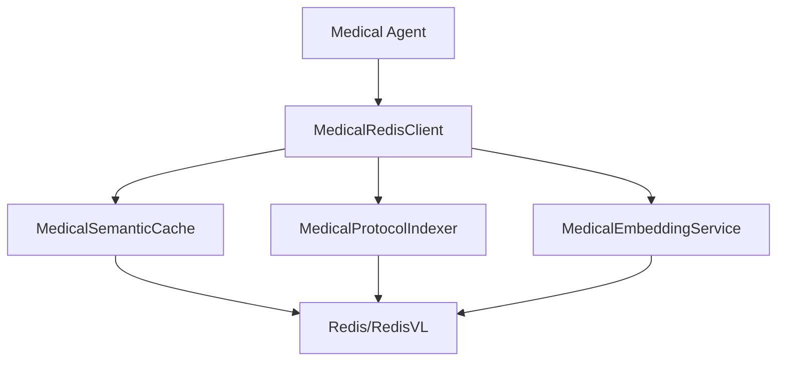

# Redis Integration Documentation

## Overview

Vigia uses Redis for semantic caching and vector search capabilities to enhance medical detection workflows. The system provides intelligent caching of medical queries and embeddings-based search for medical protocols.

## Architecture



## Key Components

### 1. MedicalRedisClient
- Unified interface for all Redis operations
- Medical context awareness
- Analytics and monitoring
- Health checks and connection management

### 2. MedicalSemanticCache
- Context-aware caching for medical queries
- Similarity-based retrieval
- Medical embeddings integration
- Automatic cache invalidation

### 3. MedicalProtocolIndexer
- Vector search for medical protocols
- HNSW index management
- Cosine similarity search
- Document embeddings storage

### 4. MedicalEmbeddingService
- Specialized embeddings for medical text
- Context enhancement for medical terms
- Efficient batch processing

## Setup Options

### Production Mode (Recommended)
```bash
# Set Redis connection
export REDIS_URL="redis://localhost:6379"
export REDIS_PASSWORD="your-redis-password"

# Start Redis server
redis-server
```

### Development Mode (Mock Client)
```bash
# No Redis required - uses in-memory mock
python examples/redis_phase2_demo.py
```

## Configuration

Environment variables:
```bash
REDIS_URL=redis://localhost:6379
REDIS_PASSWORD=your-password
REDIS_DB=0
REDIS_MAX_CONNECTIONS=10
```

## Usage Examples

### Basic Medical Cache
```python
from vigia_detect.redis_layer import MedicalRedisClient

client = MedicalRedisClient()
await client.cache_medical_result(
    query="patient pressure injury analysis",
    context={"patient_id": "P001", "body_region": "sacrum"},
    result={"severity": "grade_2", "confidence": 0.85}
)
```

### Protocol Search
```python
protocols = await client.search_protocols(
    query="grade 2 pressure injury treatment",
    patient_context={"age": 65, "mobility": "limited"}
)
```

## Monitoring

The Redis integration provides built-in analytics:
- Cache hit/miss rates
- Query performance metrics
- Memory usage tracking
- Protocol search analytics

## Deployment

### Docker Compose
```yaml
services:
  redis:
    image: redis/redis-stack:latest
    ports:
      - "6379:6379"
    environment:
      - REDIS_ARGS=--save 60 1000
```

### Render Deployment
Redis is automatically provisioned on Render with the main application deployment.

## Troubleshooting

### Connection Issues
```bash
# Test Redis connection
python scripts/test_redis_connection.py
```

### Performance Tuning
- Adjust similarity thresholds based on medical context
- Monitor cache hit rates for optimization
- Use batch operations for bulk protocol indexing

## Migration Notes

The system has been refactored from basic caching to medical-specific implementations:
- Phase 1: Basic semantic cache
- Phase 2: Medical context awareness and protocol search