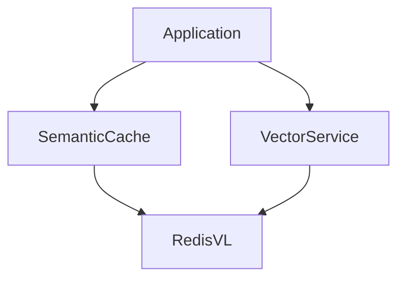

# Redis Integration - Phase 1 Documentation

## Architecture Overview
The Redis integration provides two main services:
1. **Semantic Cache** - For caching similar queries/responses
2. **Vector Search** - For RAG (Retrieval Augmented Generation) operations



## Key Components

### SemanticCache
- Uses RedisVL for similarity search
- Configurable similarity threshold
- Automatic cache invalidation

### VectorService
- Creates and manages HNSW vector indexes
- Supports cosine similarity search
- Handles document embeddings storage

## Usage Examples

### Semantic Caching
```python
from lpp_detect.redis_layer import SemanticCache

cache = SemanticCache()
response = cache.get("patient with LPP symptoms")
if not response:
    response = generate_response()
    cache.store("patient with LPP symptoms", response)
```

### Vector Search
```python
from lpp_detect.redis_layer import VectorService

vector_service = VectorService()
vector_service.create_index("protocols", dims=768)
results = vector_service.search("protocols", query_embedding)
```

## Testing Approach
- Unit tests cover all main functionality
- Mock Redis client used for isolation
- Tests verify:
  - Cache hit/miss behavior
  - Vector index creation
  - Search accuracy
