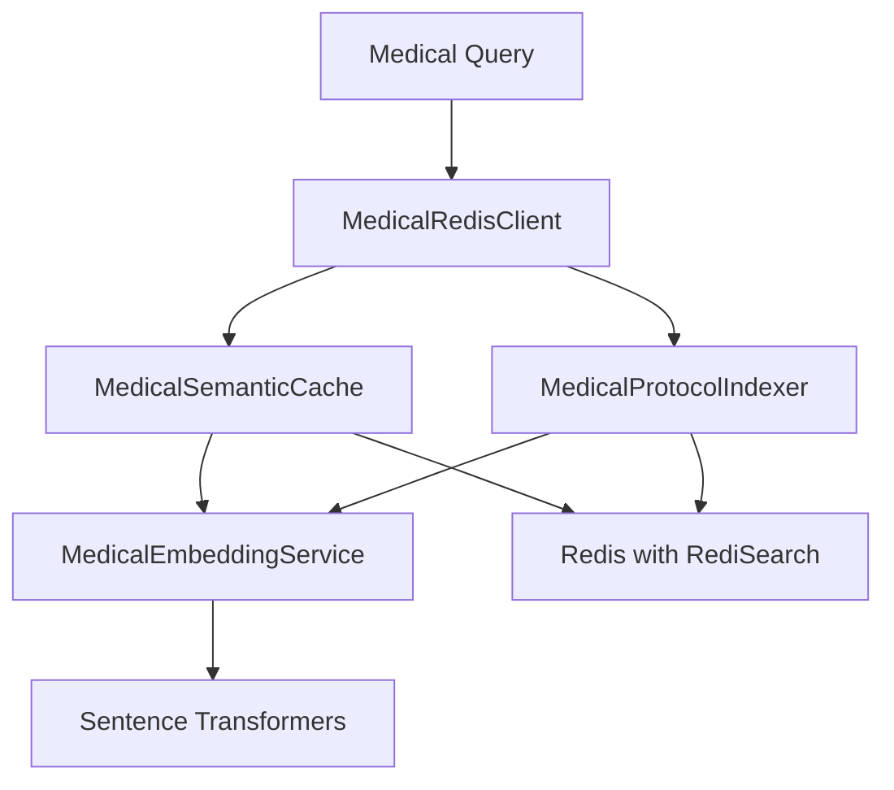

# Redis Phase 2: Medical Semantic Caching Implementation

## Overview

Phase 2 implements advanced semantic caching with medical context awareness and vector search for medical protocols. This phase transforms the basic Redis integration into a medical-specific caching and knowledge retrieval system.

## Key Features

### 1. Medical Context-Aware Caching
- **Patient-specific caching**: Same query for different patients returns different results
- **LPP grade awareness**: Cache considers injury severity in matching
- **Location-based context**: Anatomical location affects cache retrieval
- **Semantic similarity**: Uses embeddings to find similar queries even with different wording

### 2. Medical Protocol Vector Search
- **Protocol indexing**: Automatic indexing of PDF medical documents
- **Semantic search**: Find relevant protocols using natural language queries
- **Grade-specific search**: Filter protocols by LPP grade
- **Context-type filtering**: Search for treatment, prevention, or assessment protocols

### 3. Medical Embeddings
- **Specialized preprocessing**: Handles medical abbreviations and terminology
- **Context enhancement**: Enriches queries with medical context before embedding
- **Batch processing**: Efficient embedding generation for large document sets

## Architecture



## Components

### MedicalRedisClient
Unified interface for all Redis operations:
```python
from vigia_detect.redis_layer import MedicalRedisClient

client = MedicalRedisClient()

# Cache operations
cached = await client.get_cached_response(query, patient_context)
await client.cache_response(query, response, patient_context)

# Protocol search
protocols = await client.search_medical_protocols(query, lpp_grade=2)
treatment = await client.get_lpp_treatment_protocol(lpp_grade=3)
```

### MedicalSemanticCache
Context-aware caching with semantic matching:
- Generates unique cache keys based on query + context
- Uses cosine similarity for semantic matching
- Configurable similarity threshold
- Automatic cache expiration

### MedicalProtocolIndexer
Vector search for medical documents:
- PDF parsing and chunking
- Metadata extraction (grades, tags)
- HNSW index for fast similarity search
- Support for custom protocol data

### MedicalEmbeddingService
Specialized embedding generation:
- Medical text preprocessing
- Context-aware embeddings
- Batch processing support
- Configurable models (default: all-MiniLM-L6-v2)

## Usage Examples

### Basic Medical Query Caching
```python
# Medical query with patient context
query = "What is the treatment for grade 2 pressure ulcer?"
context = {
    "patient_id": "12345",
    "lpp_grade": 2,
    "location": "sacrum"
}

# Check cache
cached = await client.get_cached_response(query, context)
if not cached:
    # Generate response (from LLM or other source)
    response = generate_medical_response(query)
    # Cache for future use
    await client.cache_response(query, response, context)
```

### Protocol Search
```python
# Search for prevention protocols
prevention = await client.search_medical_protocols(
    "pressure ulcer prevention",
    context_type="prevention"
)

# Get specific treatment protocol
treatment = await client.get_lpp_treatment_protocol(lpp_grade=3)
```

### Analytics
```python
# Get cache performance metrics
stats = await client.get_cache_analytics()
print(f"Cache hit rate: {stats['cache_effectiveness']:.2%}")

# Check index health
health = client.health_check()
```

## Setup Guide

### Option 1: Automated CLI Setup (Recommended)

1. **Install dependencies**:
   ```bash
   pip install -r vigia_detect/requirements.txt
   ```

2. **Configure Redis connection** in `vigia_detect/.env`:
   ```bash
   REDIS_HOST=your-redis-host
   REDIS_PASSWORD=your-redis-password
   REDIS_PORT=6379
   REDIS_SSL=true
   ```

3. **Run automated setup**:
   ```bash
   # Using shell script
   ./scripts/redis_setup.sh
   
   # Or using Python
   python scripts/redis_cli_setup.py
   ```

### Option 2: Manual Redis CLI Setup

1. **Connect to Redis**:
   ```bash
   redis-cli -h your-host -p 6379 -a your-password --tls
   ```

2. **Create indexes using commands from**:
   ```bash
   # Interactive guide
   python scripts/redis_interactive_setup.py
   
   # Or see all commands
   cat scripts/redis_cli_commands.md
   ```

### Option 3: Development Mode (No Redis)

For development without Redis:
```python
from vigia_detect.redis_layer import create_redis_client

# Automatically uses mock client if Redis not available
client = create_redis_client()
```

## Performance Considerations

### Embedding Generation
- First query requires embedding generation (~50-100ms)
- Cached queries return in <10ms
- Batch processing available for bulk operations

### Index Performance
- HNSW index provides O(log n) search complexity
- Supports millions of documents
- Configurable M and EF parameters for accuracy/speed tradeoff

### Memory Usage
- Each embedding uses ~1.5KB (384 dimensions × 4 bytes)
- Protocol chunks average 2KB including metadata
- Cache entries expire automatically based on TTL

## Best Practices

1. **Always include medical context** when caching patient-specific queries
2. **Set appropriate TTL** for different types of data (shorter for dynamic, longer for protocols)
3. **Monitor cache effectiveness** and adjust similarity threshold as needed
4. **Index protocols during off-peak hours** to avoid performance impact
5. **Use batch operations** when processing multiple queries

## Troubleshooting

### Common Issues

1. **"Index not found" error**
   - Run the migration script to create indexes
   - Check Redis connection settings

2. **Low cache hit rate**
   - Adjust similarity threshold (default 0.85)
   - Ensure consistent context structure

3. **Slow embedding generation**
   - Consider using GPU if available
   - Use smaller model for non-critical queries

### Debug Mode
```python
import logging
logging.basicConfig(level=logging.DEBUG)

# This will show detailed Redis operations
client = MedicalRedisClient()
```

## Next Steps (Phase 3 & 4)

### Phase 3: Advanced Vector Search
- Multi-modal embeddings (text + images)
- Hierarchical protocol organization
- Cross-lingual search support

### Phase 4: Full Integration
- Real-time cache warming
- Distributed caching across multiple Redis instances
- Advanced analytics and monitoring

## References

- [Redis Vector Similarity Search](https://redis.io/docs/stack/search/reference/vectors/)
- [Sentence Transformers](https://www.sbert.net/)
- [Medical NLP Best Practices](https://github.com/EmilyAlsentzer/clinicalBERT)