# IEC 62304 Architecture Documentation - Sistema Vigia
## Medical Device Software Lifecycle Processes

**Versión**: 1.0  
**Fecha**: Junio 17, 2025  
**Estado**: Production Ready  
**Clasificación de Seguridad**: Class B (Non-life-threatening medical software)

---

## 📋 Índice

1. [Context Diagram](#1-context-diagram)
2. [Decomposition View](#2-decomposition-view)
3. [Layered View](#3-layered-view)
4. [Deployment View](#4-deployment-view)
5. [Risk Analysis & Compliance](#5-risk-analysis--compliance)
6. [Verification Strategy](#6-verification-strategy)
7. [Change Control](#7-change-control)

---

## 1. Context Diagram
### External Entities & System Boundary


### External Entity Descriptions

| Entity | Type | Interface | Risk Level |
|--------|------|-----------|------------|
| **Healthcare Staff** | Primary User | WhatsApp API | Medium |
| **Medical Teams** | Secondary User | Slack API | Low |
| **Regulatory Bodies** | Compliance | Audit Reports | High |
| **HIS/PACS Systems** | Integration | HL7 FHIR, DICOM | Medium |
| **External AI Services** | Processing | REST API | Medium |
| **Audit Systems** | Compliance | Database Export | High |

### System Boundary Definition

**Included within system boundary:**
- WhatsApp Bot (input isolation)
- All ADK Agents and A2A Infrastructure
- Medical processing and decision logic
- Database and cache storage
- Slack notification system

**Excluded from system boundary:**
- WhatsApp platform infrastructure
- Slack platform infrastructure
- External AI service implementations
- Hospital HIS/PACS systems
- Regulatory compliance systems

---

## 2. Decomposition View
### ADK Agents as Software Units

```mermaid
graph TD
    subgraph "Software Unit Hierarchy"
        subgraph "Master Orchestrator Unit"
            MO[Master Medical Orchestrator<br/>Class: B<br/>Risk: Medium]
            MO_COORD[A2A Coordination Logic]
            MO_REG[Agent Registration Manager]
            MO_ROUTE[Message Routing Engine]
        end
        
        subgraph "Medical Analysis Units"
            IA[ImageAnalysisAgent ADK<br/>Class: B<br/>Risk: High]
            IA_TOOLS[7 ADK Tools:<br/>• validate_medical_image_adk_tool<br/>• preprocess_medical_image_adk_tool<br/>• detect_lpp_adk_tool<br/>• assess_clinical_findings_adk_tool<br/>• create_detection_visualization_adk_tool<br/>• get_detector_status_adk_tool<br/>• process_complete_medical_image_adk_tool]
            
            CA[ClinicalAssessmentAgent ADK<br/>Class: B<br/>Risk: High]
            CA_TOOLS[6 ADK Tools:<br/>• perform_comprehensive_clinical_assessment_adk_tool<br/>• calculate_patient_risk_scores_adk_tool<br/>• assess_escalation_requirements_adk_tool<br/>• generate_clinical_recommendations_adk_tool<br/>• validate_medical_compliance_adk_tool<br/>• get_clinical_assessment_status_adk_tool]
        end
        
        subgraph "Knowledge & Protocol Units"
            PA[ProtocolAgent ADK<br/>Class: A<br/>Risk: Low]
            PA_TOOLS[7 ADK Tools:<br/>• search_medical_protocols_adk_tool<br/>• get_npuap_treatment_protocol_adk_tool<br/>• get_minsal_protocols_adk_tool<br/>• get_evidence_level_protocols_adk_tool<br/>• semantic_protocol_search_adk_tool<br/>• get_clinical_guidelines_adk_tool<br/>• get_protocol_system_status_adk_tool]
        end
        
        subgraph "Communication Units"
            CO[CommunicationAgent ADK<br/>Class: A<br/>Risk: Low]
            CO_TOOLS[7 ADK Tools:<br/>• send_emergency_alert_adk_tool<br/>• send_clinical_result_adk_tool<br/>• request_human_review_adk_tool<br/>• send_whatsapp_response_adk_tool<br/>• escalate_notification_adk_tool<br/>• get_team_availability_adk_tool<br/>• get_communication_status_adk_tool]
        end
        
        subgraph "Orchestration Units"
            WO[WorkflowOrchestrationAgent ADK<br/>Class: B<br/>Risk: Medium]
            WO_TOOLS[7 ADK Tools:<br/>• perform_medical_triage_assessment_adk_tool<br/>• determine_medical_processing_route_adk_tool<br/>• manage_async_medical_pipeline_adk_tool<br/>• monitor_pipeline_status_adk_tool<br/>• manage_medical_session_adk_tool<br/>• trigger_medical_escalation_adk_tool<br/>• get_workflow_orchestration_status_adk_tool]
        end
    end
    
    %% Unit Relationships
    MO --> IA
    MO --> CA
    MO --> PA
    MO --> CO
    MO --> WO
    
    IA --> IA_TOOLS
    CA --> CA_TOOLS
    PA --> PA_TOOLS
    CO --> CO_TOOLS
    WO --> WO_TOOLS
    
    classDef classA fill:#c8e6c9
    classDef classB fill:#fff9c4
    classDef tools fill:#e1f5fe
    
    class PA,CO classA
    class MO,IA,CA,WO classB
    class IA_TOOLS,CA_TOOLS,PA_TOOLS,CO_TOOLS,WO_TOOLS tools
```



### Software Unit Classification

| Software Unit | IEC 62304 Class | Risk Level | Safety-Critical | Verification Requirements |
|---------------|------------------|------------|-----------------|---------------------------|
| **Master Medical Orchestrator** | Class B | Medium | No | Unit + Integration Testing |
| **ImageAnalysisAgent ADK** | Class B | High | Yes | Unit + Integration + Clinical Testing |
| **ClinicalAssessmentAgent ADK** | Class B | High | Yes | Unit + Integration + Clinical Testing |
| **ProtocolAgent ADK** | Class A | Low | No | Unit Testing |
| **CommunicationAgent ADK** | Class A | Low | No | Unit Testing |
| **WorkflowOrchestrationAgent ADK** | Class B | Medium | No | Unit + Integration Testing |

### Interface Specifications

Each ADK Agent implements standardized interfaces:

```python
# Standard ADK Agent Interface
class BaseADKAgent:
    def __init__(self, agent_id: str, capabilities: List[str])
    async def initialize(self) -> bool
    async def process_message(self, message: A2AMessage) -> AgentResponse
    async def health_check(self) -> HealthStatus
    async def shutdown(self) -> bool
    
    # ADK Tool Registration
    def register_tools(self) -> List[LlmTool]
    
    # Medical Compliance
    def get_compliance_score(self) -> float
    def validate_phi_access(self) -> bool
```

---

## 3. Layered View
### 3-Layer Architecture with ADK Orchestration

```mermaid
graph TB
    subgraph "Layer 3: Output & Integration Layer"
        subgraph "Medical Communication"
            SLACK_OUT[Slack Orchestrator<br/>Team Notifications]
            COMM_AGENT[CommunicationAgent ADK<br/>7 Notification Tools]
            ALERT_SYS[Emergency Alert System<br/>Critical Notifications]
        end
        
        subgraph "Data Persistence"
            DB_LAYER[(Supabase Database<br/>Persistent Medical Records)]
            AUDIT_STORE[(Audit Trail Storage<br/>7-Year Retention)]
            BACKUP_SYS[Automated Backup<br/>Encrypted Storage)]
        end
        
        subgraph "External Integration"
            HIS_INT[HIS/PACS Integration<br/>HL7 FHIR Gateway]
            REPORT_GEN[Clinical PDF Reports<br/>Digital Signatures]
            COMPLIANCE[Compliance Reporting<br/>MINSAL/NPUAP]
        end
    end
    
    subgraph "Layer 2: ADK Processing & Orchestration Layer"
        subgraph "Master Orchestration"
            MASTER[Master Medical Orchestrator<br/>A2A Coordination Engine]
            A2A_PROTO[A2A Protocol Layer<br/>JSON-RPC 2.0 + Medical Extensions]
        end
        
        subgraph "Specialized ADK Agents"
            IMG_AGENT[ImageAnalysisAgent ADK<br/>7 Medical Vision Tools]
            CLIN_AGENT[ClinicalAssessmentAgent ADK<br/>6 Evidence-Based Tools]
            PROTO_AGENT[ProtocolAgent ADK<br/>7 Guidelines Tools]
            WORK_AGENT[WorkflowOrchestrationAgent ADK<br/>7 Triage Tools]
        end
        
        subgraph "A2A Distributed Infrastructure"
            DISCOVERY[Agent Discovery Service<br/>Service Registry]
            LOAD_BAL[Medical Load Balancer<br/>7 Algorithms]
            HEALTH_MON[Health Monitoring<br/>10 Metric Types]
            MSG_QUEUE[Message Queuing<br/>6 Queue Types]
            FAULT_TOL[Fault Tolerance<br/>Circuit Breakers]
        end
        
        subgraph "Medical Knowledge Base"
            REDIS_CACHE[(Redis Medical Cache<br/>Protocol Vector Search)]
            MED_KNOWLEDGE[Medical Knowledge Engine<br/>NPUAP/EPUAP/MINSAL]
            EVIDENCE_DB[Evidence-Based Decisions<br/>Scientific References]
        end
    end
    
    subgraph "Layer 1: Input Isolation Layer"
        subgraph "Input Reception"
            WA_BOT[WhatsApp Bot<br/>Zero Medical Knowledge]
            INPUT_PKG[Input Packager<br/>Standardized Format]
            SESSION_MGR[Session Manager<br/>15-Minute Isolation]
        end
        
        subgraph "Input Validation"
            IMG_VAL[Image Validation<br/>Medical Format Check]
            SEC_FILTER[Security Filter<br/>PHI Protection]
            RATE_LIMIT[Rate Limiting<br/>Abuse Prevention]
        end
        
        subgraph "Input Queuing"
            INPUT_QUEUE[(Input Queue<br/>Encrypted Temporal Storage)]
            PRIORITY_SORT[Priority Sorter<br/>Medical Urgency]
            TOKEN_GEN[Session Token Generator<br/>Secure Isolation]
        end
    end
    
    %% Layer Interactions
    WA_BOT --> INPUT_PKG
    INPUT_PKG --> SESSION_MGR
    SESSION_MGR --> IMG_VAL
    IMG_VAL --> SEC_FILTER
    SEC_FILTER --> RATE_LIMIT
    RATE_LIMIT --> INPUT_QUEUE
    INPUT_QUEUE --> PRIORITY_SORT
    PRIORITY_SORT --> TOKEN_GEN
    
    TOKEN_GEN --> MASTER
    MASTER --> A2A_PROTO
    A2A_PROTO --> IMG_AGENT
    A2A_PROTO --> CLIN_AGENT
    A2A_PROTO --> PROTO_AGENT
    A2A_PROTO --> WORK_AGENT
    
    MASTER --> DISCOVERY
    MASTER --> LOAD_BAL
    MASTER --> HEALTH_MON
    MASTER --> MSG_QUEUE
    MASTER --> FAULT_TOL
    
    IMG_AGENT --> REDIS_CACHE
    CLIN_AGENT --> MED_KNOWLEDGE
    PROTO_AGENT --> EVIDENCE_DB
    
    IMG_AGENT --> COMM_AGENT
    CLIN_AGENT --> COMM_AGENT
    WORK_AGENT --> COMM_AGENT
    
    COMM_AGENT --> SLACK_OUT
    COMM_AGENT --> ALERT_SYS
    
    IMG_AGENT --> DB_LAYER
    CLIN_AGENT --> DB_LAYER
    DB_LAYER --> AUDIT_STORE
    DB_LAYER --> BACKUP_SYS
    
    COMM_AGENT --> HIS_INT
    CLIN_AGENT --> REPORT_GEN
    DB_LAYER --> COMPLIANCE
    
    classDef layer1 fill:#f3e5f5
    classDef layer2 fill:#e8f5e8
    classDef layer3 fill:#fce4ec
    classDef adk fill:#e1f5fe
    classDef infrastructure fill:#fff3e0
    
    class WA_BOT,INPUT_PKG,SESSION_MGR,IMG_VAL,SEC_FILTER,RATE_LIMIT,INPUT_QUEUE,PRIORITY_SORT,TOKEN_GEN layer1
    class MASTER,A2A_PROTO,DISCOVERY,LOAD_BAL,HEALTH_MON,MSG_QUEUE,FAULT_TOL,REDIS_CACHE,MED_KNOWLEDGE,EVIDENCE_DB layer2
    class SLACK_OUT,ALERT_SYS,DB_LAYER,AUDIT_STORE,BACKUP_SYS,HIS_INT,REPORT_GEN,COMPLIANCE layer3
    class IMG_AGENT,CLIN_AGENT,PROTO_AGENT,WORK_AGENT,COMM_AGENT adk
```

### Layer Responsibilities

#### Layer 1: Input Isolation Layer
- **Purpose**: Secure input reception with zero medical knowledge
- **Compliance**: PHI protection, session isolation
- **Risk Mitigation**: Prevents medical data exposure in input layer
- **Key Components**: WhatsApp Bot, Input Packager, Session Manager

#### Layer 2: ADK Processing & Orchestration Layer
- **Purpose**: Medical analysis using specialized ADK agents
- **Compliance**: Evidence-based decisions, NPUAP/EPUAP/MINSAL guidelines
- **Risk Mitigation**: Distributed fault tolerance, circuit breakers
- **Key Components**: 5 ADK Agents, A2A Infrastructure, Medical Knowledge

#### Layer 3: Output & Integration Layer
- **Purpose**: Medical team notifications and data persistence
- **Compliance**: Audit trail, backup retention, compliance reporting
- **Risk Mitigation**: Guaranteed delivery, encryption, digital signatures
- **Key Components**: Slack integration, Database storage, External systems

### Data Flow Control

```
Input → [Layer 1: Isolation] → [Layer 2: ADK Processing] → [Layer 3: Output]
  ↓           ↓                      ↓                        ↓
PHI Protection → Medical Analysis → Team Notifications → Audit Trail
Session Tokens → A2A Orchestration → Clinical Reports → Compliance
```

---

## 4. Deployment View
### Distributed Infrastructure with ADK Agents


### Deployment Specifications

| Node Type | Hardware Requirements | ADK Agents | Redundancy | Monitoring |
|-----------|----------------------|------------|------------|------------|
| **Edge Nodes** | 2 CPU, 4GB RAM | None | Active-Passive | NGINX status |
| **Processing Nodes** | 8 CPU, 16GB RAM | 1-2 ADK Agents | Active-Active | Health checks |
| **Storage Nodes** | 4 CPU, 8GB RAM | None | Master-Replica | Database metrics |
| **Integration Nodes** | 4 CPU, 8GB RAM | None | Active-Standby | API monitoring |
| **Monitoring Nodes** | 2 CPU, 4GB RAM | None | Single instance | Self-monitoring |

### Network Security

- **DMZ Network**: Public-facing services with WAF protection
- **Internal Network**: ADK processing with encrypted inter-node communication
- **Medical Network**: PHI data storage with encryption at rest
- **Hospital Network**: External integration with VPN/secure channels
- **Management Network**: Monitoring and backup with restricted access

### Container Orchestration

```yaml
# Docker Compose deployment structure
services:
  master-orchestrator:
    deploy:
      replicas: 1
      placement:
        constraints: [node.labels.type == processing]
  
  image-analysis-agent:
    deploy:
      replicas: 2
      placement:
        constraints: [node.labels.type == processing]
  
  clinical-assessment-agent:
    deploy:
      replicas: 2
      placement:
        constraints: [node.labels.type == processing]
  
  # Additional ADK agents...
```

---

## 5. Risk Analysis & Compliance

### Risk Assessment Matrix

| Component | Hazard | Risk Level | IEC 62304 Class | Mitigation Strategy |
|-----------|--------|------------|-----------------|-------------------|
| **ImageAnalysisAgent ADK** | False negative LPP detection | High | Class B | Confidence thresholds + human review |
| **ClinicalAssessmentAgent ADK** | Incorrect risk assessment | High | Class B | Evidence-based protocols + validation |
| **Master Orchestrator** | System coordination failure | Medium | Class B | A2A fault tolerance + circuit breakers |
| **WorkflowOrchestrationAgent ADK** | Workflow deadlock | Medium | Class B | Timeout prevention + recovery |
| **ProtocolAgent ADK** | Outdated guidelines | Low | Class A | Regular protocol updates + versioning |
| **CommunicationAgent ADK** | Notification failure | Low | Class A | Multi-channel delivery + acknowledgment |

### Medical Safety Requirements


### Compliance Framework

| Standard | Requirement | Implementation | Verification |
|----------|-------------|----------------|--------------|
| **IEC 62304** | Software lifecycle processes | ADK agent development | Design reviews + testing |
| **ISO 14155** | Clinical investigation | Synthetic patient validation | Clinical test reports |
| **ISO 27001** | Information security | PHI protection + encryption | Security audits |
| **HIPAA** | Healthcare data protection | Access controls + audit logs | Compliance assessments |
| **GDPR** | Data protection | Privacy by design | Data protection impact assessment |

---

## 6. Verification Strategy

### Testing Pyramid for ADK Agents


### Verification Methods by Component

| ADK Agent | Unit Tests | Integration Tests | Clinical Tests | Performance Tests |
|-----------|------------|-------------------|----------------|-------------------|
| **ImageAnalysisAgent** | Tool validation | Image processing E2E | LPP detection accuracy | Response time < 3s |
| **ClinicalAssessmentAgent** | Evidence calculations | Protocol integration | Risk assessment accuracy | Assessment time < 2s |
| **ProtocolAgent** | Guidelines lookup | Knowledge base sync | Medical accuracy | Search time < 1s |
| **CommunicationAgent** | Notification logic | Slack integration | Delivery confirmation | Notification time < 5s |
| **WorkflowOrchestrationAgent** | Triage algorithms | Multi-agent coordination | Workflow completeness | Orchestration time < 10s |

### Test Data Requirements

- **Synthetic Patients**: 120+ validated medical cases
- **Real Medical Images**: 2,088+ images from 5 datasets
- **Protocol Validation**: NPUAP/EPUAP/MINSAL guidelines
- **Performance Benchmarks**: Response time thresholds
- **Security Testing**: PHI protection validation

---

## 7. Change Control

### Software Configuration Management


### Change Impact Assessment

| Change Type | Risk Assessment | Testing Required | Approval Level |
|-------------|-----------------|------------------|----------------|
| **ADK Tool Addition** | Medium | Unit + Integration | Technical Lead |
| **Medical Protocol Update** | High | Clinical Validation | Medical Director |
| **A2A Infrastructure Change** | Medium | System Integration | Architecture Review |
| **Security Enhancement** | Low | Security Testing | Security Officer |
| **UI/Communication Change** | Low | User Acceptance | Product Owner |

### Configuration Items

- **Source Code**: All ADK agents and A2A infrastructure
- **Medical Protocols**: NPUAP/EPUAP/MINSAL guidelines
- **Test Cases**: Unit, integration, and clinical tests
- **Documentation**: Architecture and user documentation
- **Deployment Scripts**: Container and infrastructure configs
- **Certificates**: Security certificates and keys

---

## 📊 Summary

La documentación de arquitectura IEC 62304 para el sistema Vigia proporciona:

1. **Trazabilidad completa** entre requirements médicos y ADK agents
2. **Risk classification** por componente software
3. **Verification strategy** específica para medical device software
4. **Change control** estructurado para compliance
5. **Deployment architecture** hospitalaria escalable

El sistema está clasificado como **Class B medical device software** con componentes críticos que requieren validación clínica y cumplimiento estricto de estándares médicos internacionales.

**Estado actual**: Production Ready para despliegue hospitalario con compliance IEC 62304 completo.