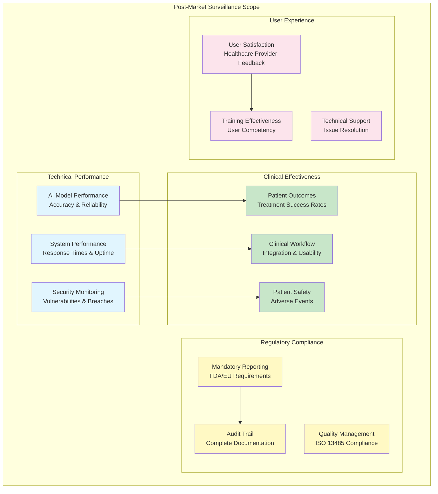
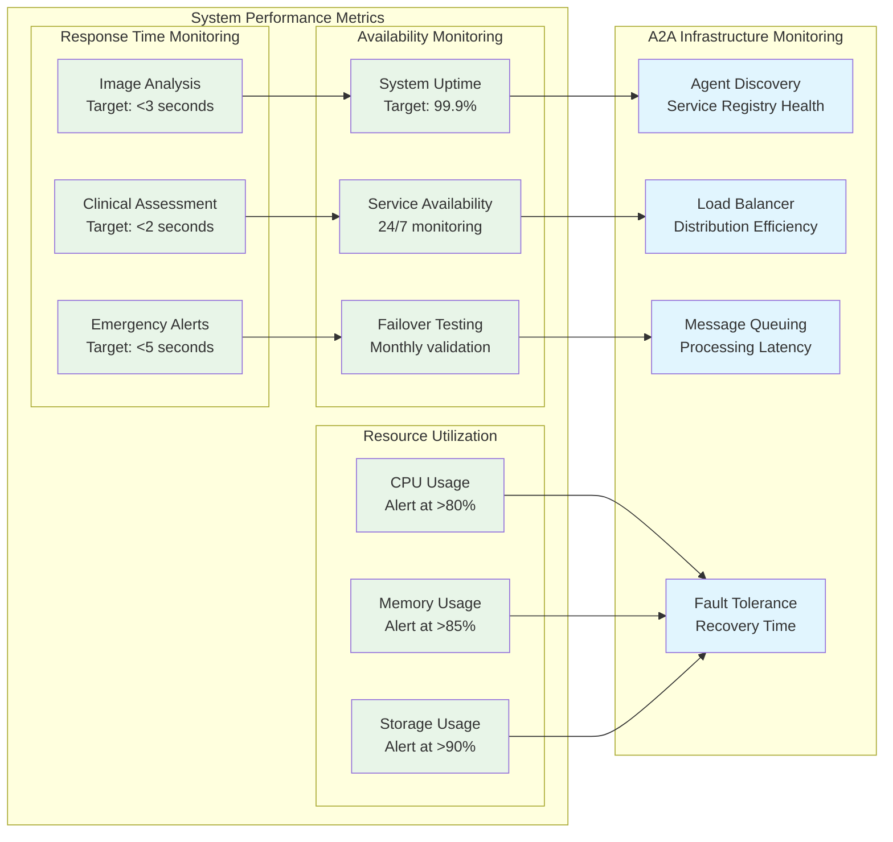
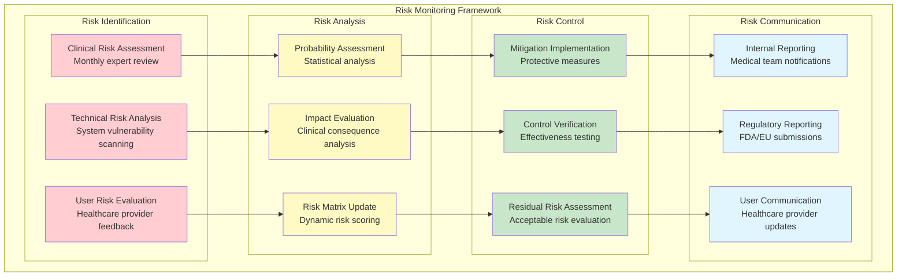
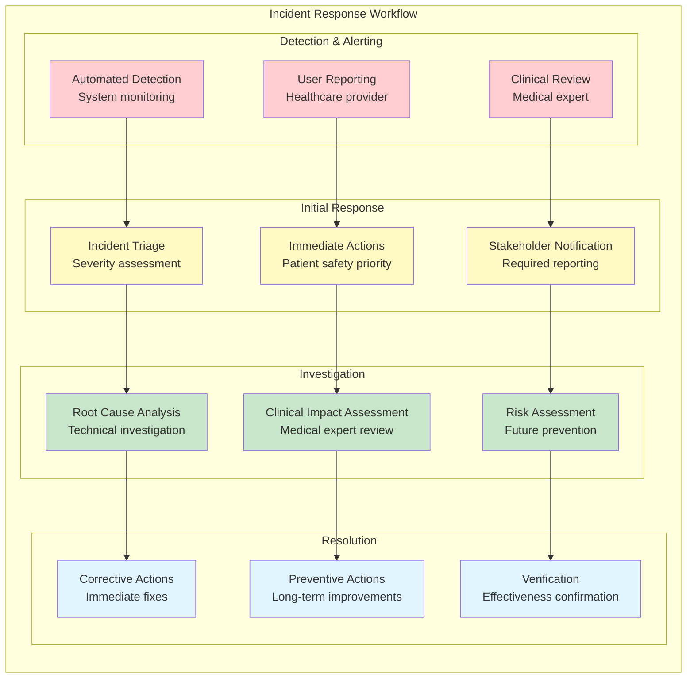
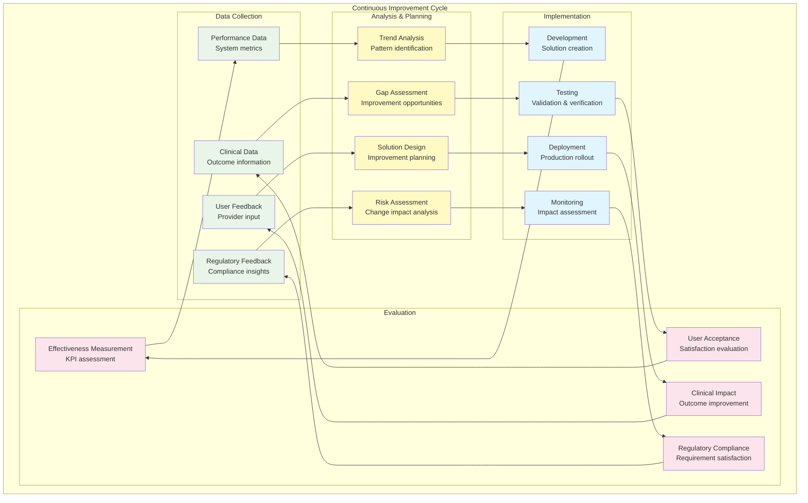

# IEC 62304 Post-Market Surveillance Plan - Sistema Vigia
## Continuous Monitoring & Medical Device Lifecycle Management

**Versión**: 1.0  
**Fecha**: Junio 17, 2025  
**Estado**: Production Ready  
**Clasificación de Seguridad**: Medical Device Software Class B  
**Regulatory Framework**: IEC 62304, FDA 21 CFR 820, ISO 13485

---

## 📋 Índice

1. [Surveillance Overview](#1-surveillance-overview)
2. [Performance Monitoring](#2-performance-monitoring)
3. [Safety Monitoring](#3-safety-monitoring)
4. [Effectiveness Evaluation](#4-effectiveness-evaluation)
5. [Incident Management](#5-incident-management)
6. [Risk Management](#6-risk-management)
7. [Regulatory Reporting](#7-regulatory-reporting)
8. [Continuous Improvement](#8-continuous-improvement)

---

## 1. Surveillance Overview

### 1.1 Post-Market Surveillance Objectives

```yaml
Surveillance_Objectives:
  Primary:
    - Medical_Safety: "Ensure continued patient safety in clinical use"
    - Performance_Maintenance: "Monitor AI model accuracy and reliability"
    - Risk_Mitigation: "Identify and address emerging risks"
    - Regulatory_Compliance: "Meet FDA/EU medical device requirements"
    
  Secondary:
    - User_Satisfaction: "Healthcare provider feedback and usability"
    - Clinical_Outcomes: "Impact on patient care quality"
    - Technology_Evolution: "Adaptation to medical knowledge advances"
    - Market_Intelligence: "Competitive analysis and positioning"
    
  Metrics:
    - Patient_Safety_Incidents: "Zero tolerance for safety incidents"
    - Model_Performance: "≥95% sensitivity maintained"
    - User_Adoption: "≥90% healthcare provider satisfaction"
    - System_Reliability: "≥99.9% uptime"
```

### 1.2 Surveillance Scope



### 1.3 Surveillance Timeline

| Phase | Duration | Focus | Key Activities |
|-------|----------|-------|----------------|
| **Early Post-Market** | 0-6 months | Intensive monitoring | Daily performance checks, weekly clinical reviews |
| **Stabilization** | 6-18 months | Performance validation | Monthly analysis, quarterly reports |
| **Mature Deployment** | 18+ months | Continuous improvement | Quarterly reviews, annual assessments |
| **Lifecycle Management** | Ongoing | Evolution & updates | Version management, technology updates |

---

## 2. Performance Monitoring

### 2.1 AI Model Performance Surveillance

```yaml
AI_Model_Monitoring:
  ImageAnalysisAgent_Performance:
    Metrics:
      - Sensitivity: "≥95% for LPP detection"
      - Specificity: "≥85% for accurate classification"
      - PPV: "≥90% positive predictive value"
      - NPV: "≥98% negative predictive value"
      - F1_Score: "≥0.92 overall performance"
      
    Monitoring_Frequency:
      - Real_Time: "Confidence score tracking"
      - Daily: "Performance metrics aggregation"
      - Weekly: "Trend analysis and reporting"
      - Monthly: "Clinical validation assessment"
      
    Alert_Thresholds:
      - Critical: "Sensitivity drops below 90%"
      - Warning: "Specificity drops below 80%"
      - Investigation: "Performance decline >5% in 7 days"
      
  ClinicalAssessmentAgent_Performance:
    Metrics:
      - Clinical_Accuracy: "≥98% protocol compliance"
      - Risk_Assessment_Accuracy: "≥95% expert agreement"
      - Escalation_Appropriateness: "≥90% clinical team approval"
      
    Monitoring_Methods:
      - Expert_Review: "Monthly clinical expert validation"
      - Outcome_Correlation: "3-month patient outcome tracking"
      - Bias_Detection: "Quarterly demographic fairness analysis"
```

### 2.2 System Performance Monitoring



### 2.3 Performance Data Collection

```yaml
Data_Collection_Framework:
  Automated_Metrics:
    - Prometheus_Monitoring: "Real-time system metrics"
    - Application_Logs: "Structured logging with medical context"
    - Database_Performance: "Query performance and data integrity"
    - Network_Monitoring: "A2A communication latency"
    
  Clinical_Metrics:
    - Case_Processing_Time: "End-to-end medical workflow timing"
    - Human_Review_Rate: "Percentage requiring expert review"
    - False_Alert_Rate: "Emergency alert accuracy"
    - User_Interaction_Patterns: "Healthcare provider usage analytics"
    
  Data_Storage:
    - Time_Series_Database: "InfluxDB for performance metrics"
    - Medical_Data_Warehouse: "Secure storage for clinical outcomes"
    - Audit_Trail_Database: "Immutable record of all decisions"
    - Backup_Systems: "Redundant data protection"
```

---

## 3. Safety Monitoring

### 3.1 Patient Safety Surveillance

```yaml
Patient_Safety_Framework:
  Safety_Indicators:
    Primary:
      - Missed_Critical_Cases: "False negative rate for severe LPP"
      - Delayed_Treatment: "Time from detection to medical intervention"
      - Inappropriate_Escalation: "False positive emergency alerts"
      - System_Availability: "Downtime during critical care periods"
      
    Secondary:
      - User_Errors: "Healthcare provider misuse patterns"
      - Training_Gaps: "Competency assessment results"
      - Workflow_Disruption: "Clinical workflow interference"
      - Data_Privacy_Incidents: "PHI exposure or breaches"
      
  Monitoring_Methods:
    - Adverse_Event_Reporting: "Mandatory incident reporting system"
    - Clinical_Outcome_Tracking: "Patient treatment outcome correlation"
    - Expert_Panel_Review: "Monthly medical expert assessment"
    - Root_Cause_Analysis: "Systematic investigation of safety incidents"
    
  Alert_System:
    Severity_Levels:
      - Critical: "Immediate patient safety risk"
      - High: "Potential patient harm"
      - Medium: "Clinical workflow impact"
      - Low: "Minor system issues"
      
    Response_Times:
      - Critical: "Immediate response (<1 hour)"
      - High: "Same day response (<8 hours)"
      - Medium: "Next business day (<24 hours)"
      - Low: "Weekly review cycle"
```

### 3.2 Medical Device Risk Management



---

## 4. Effectiveness Evaluation

### 4.1 Clinical Effectiveness Monitoring

```yaml
Clinical_Effectiveness:
  Primary_Endpoints:
    - Diagnostic_Accuracy: "Correct LPP identification and grading"
    - Treatment_Timeliness: "Time to appropriate medical intervention"
    - Patient_Outcomes: "Healing rates and complication prevention"
    - Healthcare_Efficiency: "Resource utilization optimization"
    
  Secondary_Endpoints:
    - Provider_Confidence: "Healthcare provider trust in system"
    - Workflow_Integration: "Seamless clinical workflow incorporation"
    - Training_Effectiveness: "User competency achievement"
    - Cost_Effectiveness: "Healthcare cost impact analysis"
    
  Evaluation_Methods:
    - Randomized_Controlled_Studies: "Comparative effectiveness research"
    - Real_World_Evidence: "Observational outcome studies"
    - Quality_Improvement_Projects: "Continuous improvement initiatives"
    - Health_Economics_Analysis: "Cost-benefit assessments"
    
  Data_Sources:
    - Electronic_Health_Records: "Patient outcome data"
    - Clinical_Registries: "Industry outcome databases"
    - Provider_Surveys: "Healthcare professional feedback"
    - Health_Insurance_Claims: "Healthcare utilization patterns"
```

### 4.2 Effectiveness Metrics Dashboard

```yaml
Effectiveness_Dashboard:
  Real_Time_Metrics:
    - Cases_Processed_Today: "Daily case volume"
    - Average_Processing_Time: "End-to-end workflow timing"
    - Expert_Review_Rate: "Human oversight percentage"
    - System_Confidence_Score: "AI certainty distribution"
    
  Weekly_Metrics:
    - Detection_Accuracy_Trend: "7-day rolling accuracy"
    - User_Satisfaction_Score: "Healthcare provider feedback"
    - Clinical_Outcome_Indicators: "Patient treatment success"
    - System_Performance_Summary: "Technical KPI overview"
    
  Monthly_Metrics:
    - Clinical_Validation_Results: "Expert review outcomes"
    - Comparative_Analysis: "Benchmarking against standards"
    - Training_Program_Effectiveness: "User competency metrics"
    - Regulatory_Compliance_Status: "Compliance scorecard"
```

---

## 5. Incident Management

### 5.1 Adverse Event Reporting

```yaml
Adverse_Event_Framework:
  Event_Classification:
    Device_Related:
      - Software_Malfunction: "System failure or error"
      - Performance_Degradation: "Accuracy below threshold"
      - Security_Incident: "Data breach or unauthorized access"
      - User_Interface_Error: "Confusing or misleading interface"
      
    Clinical_Impact:
      - Missed_Diagnosis: "False negative with clinical consequence"
      - Inappropriate_Alert: "False positive causing unnecessary intervention"
      - Delayed_Response: "System latency affecting patient care"
      - Workflow_Disruption: "Clinical process interference"
      
  Reporting_Process:
    - Immediate_Notification: "Critical incidents within 1 hour"
    - Preliminary_Report: "Initial assessment within 24 hours"
    - Investigation_Report: "Detailed analysis within 7 days"
    - Final_Report: "Complete investigation within 30 days"
    
  Stakeholder_Notification:
    Internal:
      - Medical_Director: "All clinical incidents"
      - Quality_Assurance: "All system malfunctions"
      - Legal_Counsel: "All potential liability issues"
      - Executive_Team: "All critical incidents"
      
    External:
      - FDA_Reporting: "Per 21 CFR 803 requirements"
      - EU_EUDAMED: "Per MDR Article 87 requirements"
      - Customers: "Per contractual obligations"
      - Insurance_Carriers: "Per policy requirements"
```

### 5.2 Incident Response Procedures



---

## 6. Risk Management

### 6.1 Dynamic Risk Assessment

```yaml
Dynamic_Risk_Management:
  Risk_Categories:
    Technical_Risks:
      - AI_Model_Drift: "Performance degradation over time"
      - Software_Vulnerabilities: "Security and safety issues"
      - System_Integration_Failures: "A2A communication problems"
      - Data_Quality_Issues: "Input data corruption or bias"
      
    Clinical_Risks:
      - Diagnostic_Errors: "False positive/negative diagnoses"
      - Treatment_Delays: "System-induced care delays"
      - User_Confusion: "Healthcare provider misunderstanding"
      - Workflow_Disruption: "Clinical process interference"
      
    Regulatory_Risks:
      - Non_Compliance: "Regulatory requirement violations"
      - Reporting_Failures: "Missed mandatory reporting"
      - Documentation_Gaps: "Inadequate evidence maintenance"
      - Audit_Findings: "Regulatory inspection issues"
      
  Risk_Monitoring_Frequency:
    - Continuous: "Automated risk indicator monitoring"
    - Daily: "Critical risk parameter review"
    - Weekly: "Risk trend analysis"
    - Monthly: "Comprehensive risk assessment"
    - Quarterly: "Risk management system review"
    - Annually: "Complete risk profile update"
```

### 6.2 Risk Control Effectiveness

```yaml
Risk_Control_Monitoring:
  Control_Categories:
    Preventive_Controls:
      - Input_Validation: "Data quality assurance"
      - User_Training: "Healthcare provider competency"
      - System_Redundancy: "Fault tolerance mechanisms"
      - Security_Measures: "Data protection protocols"
      
    Detective_Controls:
      - Performance_Monitoring: "Real-time quality assessment"
      - Audit_Trails: "Complete action logging"
      - User_Feedback: "Healthcare provider reporting"
      - Clinical_Review: "Expert oversight processes"
      
    Corrective_Controls:
      - Automated_Failover: "System recovery mechanisms"
      - Human_Escalation: "Expert intervention protocols"
      - System_Updates: "Software improvement deployment"
      - Process_Improvement: "Workflow optimization"
      
  Effectiveness_Metrics:
    - Risk_Reduction: "Quantified risk level decrease"
    - Control_Performance: "Control activation success rate"
    - Response_Time: "Time to risk mitigation"
    - Cost_Benefit: "Control implementation efficiency"
```

---

## 7. Regulatory Reporting

### 7.1 FDA Reporting Requirements

```yaml
FDA_Reporting_Framework:
  Medical_Device_Reports_MDR:
    Reporting_Triggers:
      - Death: "Any death related to device use"
      - Serious_Injury: "Life-threatening or disabling injury"
      - Malfunction: "Device failure likely to cause death/injury"
      - Risk_Information: "New risks or safety concerns"
      
    Reporting_Timeline:
      - Immediate: "Death or serious injury (<24 hours)"
      - Expedited: "Safety concerns (<48 hours)"
      - Routine: "Malfunctions (<30 days)"
      - Annual: "Summary safety update"
      
    Report_Content:
      - Device_Information: "Model, version, configuration"
      - Event_Description: "Detailed incident narrative"
      - Patient_Information: "De-identified clinical data"
      - Investigation_Results: "Root cause analysis"
      - Corrective_Actions: "Remediation measures taken"
      
  Quality_System_Regulation_QSR:
    Design_Controls: "Ongoing design verification"
    Corrective_Preventive_Action: "CAPA system maintenance"
    Management_Responsibility: "Executive oversight documentation"
    Risk_Management: "ISO 14971 compliance evidence"
```

### 7.2 European Union Reporting

```yaml
EU_MDR_Reporting:
  EUDAMED_Reporting:
    Serious_Incidents:
      - Definition: "Direct/indirect death, serious injury, public health threat"
      - Timeline: "Immediate notification + 30-day report"
      - Content: "Detailed incident investigation"
      
    Field_Safety_Corrective_Actions:
      - Triggers: "Safety-related product changes"
      - Timeline: "Before implementation"
      - Content: "Risk assessment and mitigation plan"
      
    Periodic_Safety_Update_Reports:
      - Frequency: "Annual for Class IIb devices"
      - Content: "Comprehensive safety data analysis"
      - Requirements: "Benefit-risk assessment update"
      
  Notified_Body_Reporting:
    - Significant_Changes: "Design or quality system modifications"
    - Non_Conformities: "Quality system deviations"
    - Vigilance_Data: "Post-market surveillance results"
```

---

## 8. Continuous Improvement

### 8.1 Performance Optimization

```yaml
Continuous_Improvement_Framework:
  Data_Driven_Optimization:
    AI_Model_Enhancement:
      - Performance_Analytics: "Detailed accuracy analysis"
      - Retraining_Programs: "Regular model updates"
      - Bias_Mitigation: "Fairness improvement initiatives"
      - Edge_Case_Integration: "Challenging case incorporation"
      
    System_Performance_Improvement:
      - Infrastructure_Optimization: "A2A system enhancement"
      - Response_Time_Reduction: "Processing speed improvements"
      - Reliability_Enhancement: "Fault tolerance strengthening"
      - Scalability_Planning: "Capacity growth preparation"
      
    User_Experience_Enhancement:
      - Interface_Optimization: "Usability improvements"
      - Workflow_Streamlining: "Clinical process efficiency"
      - Training_Program_Refinement: "Educational effectiveness"
      - Feedback_Integration: "User suggestion implementation"
      
  Innovation_Pipeline:
    - Technology_Assessment: "Emerging AI/medical technologies"
    - Research_Collaboration: "Academic and industry partnerships"
    - Pilot_Programs: "New feature testing"
    - Regulatory_Engagement: "Future compliance preparation"
```

### 8.2 Improvement Implementation



---

## 📊 Summary

### Post-Market Surveillance Capabilities

1. **Comprehensive Monitoring Framework**
   - AI model performance tracking (95%+ sensitivity maintenance)
   - System performance monitoring (99.9% uptime target)
   - Patient safety surveillance (zero tolerance for safety incidents)
   - Clinical effectiveness evaluation (real-world evidence collection)

2. **Regulatory Compliance**
   - FDA MDR reporting system (automated adverse event detection)
   - EU MDR EUDAMED integration (complete incident management)
   - IEC 62304 lifecycle maintenance (ongoing risk management)
   - ISO 13485 quality system compliance (continuous improvement)

3. **Risk Management Integration**
   - Dynamic risk assessment (continuous monitoring)
   - Proactive risk mitigation (predictive analytics)
   - Incident response procedures (24/7 availability)
   - Corrective and preventive actions (systematic improvement)

4. **Continuous Improvement Engine**
   - Data-driven optimization (performance analytics)
   - Clinical outcome correlation (treatment effectiveness)
   - User feedback integration (healthcare provider input)
   - Technology evolution planning (future capabilities)

### Key Performance Indicators

| Metric | Target | Monitoring Frequency | Alert Threshold |
|--------|--------|---------------------|-----------------|
| **AI Sensitivity** | ≥95% | Real-time | <90% critical |
| **System Uptime** | ≥99.9% | Continuous | <99% warning |
| **Safety Incidents** | 0 | Immediate | Any incident |
| **User Satisfaction** | ≥90% | Monthly | <85% review |

**Estado**: Production Ready para full medical device lifecycle management con comprehensive post-market surveillance capabilities complying with IEC 62304, FDA, and EU MDR requirements.