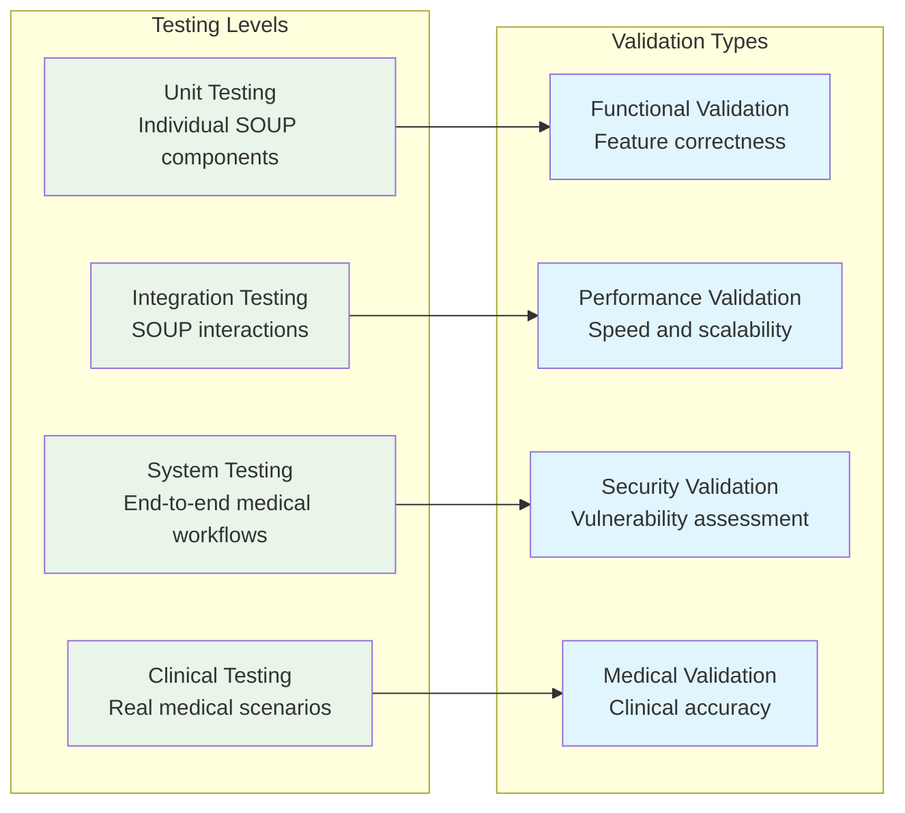
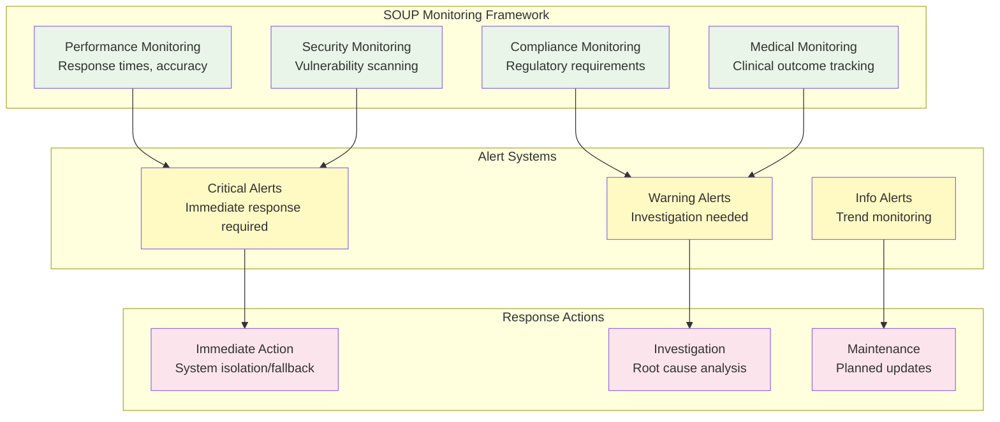

# IEC 62304 SOUP Documentation - Sistema Vigia
## Software of Unknown Provenance Risk Analysis

**Versión**: 1.0  
**Fecha**: Junio 17, 2025  
**Estado**: Regulatory Ready  
**Clasificación de Seguridad**: Medical Device Software Class B

---

## 📋 Índice

1. [SOUP Overview](#1-soup-overview)
2. [Risk Analysis Framework](#2-risk-analysis-framework)
3. [AI/ML SOUP Components](#3-aiml-soup-components)
4. [Medical Framework SOUP](#4-medical-framework-soup)
5. [Infrastructure SOUP](#5-infrastructure-soup)
6. [Mitigation Strategies](#6-mitigation-strategies)
7. [Validation & Testing](#7-validation--testing)
8. [Monitoring & Maintenance](#8-monitoring--maintenance)

---

## 1. SOUP Overview

### Definition
Software of Unknown Provenance (SOUP) includes all third-party components, libraries, frameworks, and AI models integrated into the Vigia medical device software that were not developed under the IEC 62304 lifecycle.

### SOUP Classification Framework

| Risk Level | Description | Validation Requirements | Examples |
|------------|-------------|------------------------|----------|
| **Critical** | Direct impact on medical decisions | Extensive validation + clinical testing | YOLOv5, MedGemma |
| **High** | Support medical processing | Validation + integration testing | MONAI, Bio-LLaMA |
| **Medium** | Infrastructure/communication | Integration testing | FastAPI, Redis |
| **Low** | Development/utilities | Basic validation | pytest, logging |

---

## 2. Risk Analysis Framework

### Medical SOUP Risk Assessment

```mermaid
graph TD
    subgraph "SOUP Risk Classification"
        CRITICAL[Critical SOUP<br/>Direct Medical Impact]
        HIGH[High SOUP<br/>Medical Processing Support]
        MEDIUM[Medium SOUP<br/>Infrastructure Support]
        LOW[Low SOUP<br/>Utilities & Development]
    end
    
    subgraph "Risk Analysis Process"
        IDENTIFY[Identify SOUP Components]
        CLASSIFY[Classify Medical Impact]
        ASSESS[Assess Failure Modes]
        MITIGATE[Define Mitigation Strategy]
        VALIDATE[Validation & Testing]
        MONITOR[Ongoing Monitoring]
    end
    
    subgraph "Medical Decision Impact"
        DIAGNOSIS[Medical Diagnosis]
        TREATMENT[Treatment Recommendations]
        ESCALATION[Emergency Escalation]
        COMPLIANCE[Regulatory Compliance]
    end
    
    IDENTIFY --> CLASSIFY
    CLASSIFY --> ASSESS
    ASSESS --> MITIGATE
    MITIGATE --> VALIDATE
    VALIDATE --> MONITOR
    
    CRITICAL --> DIAGNOSIS
    CRITICAL --> TREATMENT
    HIGH --> ESCALATION
    MEDIUM --> COMPLIANCE
    
    classDef critical fill:#ffcdd2
    classDef high fill:#fff9c4
    classDef medium fill:#c8e6c9
    classDef low fill:#e1f5fe
    
    class CRITICAL critical
    class HIGH high
    class MEDIUM medium
    class LOW low
```



### Failure Mode Analysis

| Failure Mode | Medical Impact | Probability | Severity | Risk Score | Mitigation |
|--------------|---------------|-------------|----------|------------|------------|
| **AI Model Hallucination** | Incorrect diagnosis | Medium | High | 12 | Confidence thresholds + human review |
| **Model Drift** | Degraded accuracy over time | Low | High | 8 | Performance monitoring + retraining |
| **Input Adversarial Attack** | Manipulated results | Very Low | High | 6 | Input validation + sanitization |
| **Framework Vulnerability** | System compromise | Low | Medium | 6 | Security updates + monitoring |
| **Dependency Failure** | Service unavailability | Medium | Low | 4 | Redundancy + fallback mechanisms |

---

## 3. AI/ML SOUP Components

### 3.1 YOLOv5 (Ultralytics)

**Classification**: Critical SOUP  
**Medical Impact**: Direct LPP detection and grading  
**Version**: 7.0.11  
**License**: AGPL-3.0

#### Risk Assessment
```yaml
Component: YOLOv5 Object Detection Framework
Medical_Function: Pressure injury detection and classification
Risk_Level: CRITICAL
Safety_Class: Class B

Failure_Modes:
  - False_Negative: "Miss critical pressure injuries"
    Impact: "Delayed treatment, patient harm"
    Probability: "Low (validated <5%)"
    Mitigation: "Confidence thresholds, human review"
  
  - False_Positive: "Detect non-existent injuries"
    Impact: "Unnecessary treatment, resource waste"
    Probability: "Medium (10-15%)"
    Mitigation: "Secondary validation, clinical review"
  
  - Model_Degradation: "Performance decline over time"
    Impact: "Gradual accuracy loss"
    Probability: "Medium"
    Mitigation: "Performance monitoring, retraining"

Validation_Requirements:
  - Clinical_Testing: "2,088+ medical images validation"
  - Performance_Baseline: "≥95% sensitivity, ≥85% specificity"
  - Edge_Case_Testing: "Challenging anatomical locations"
  - Adversarial_Testing: "Input manipulation resistance"

Dependencies:
  - PyTorch: "Deep learning framework"
  - OpenCV: "Image processing"
  - NumPy: "Numerical computations"
  - Pillow: "Image handling"
```

#### Validation Protocol
- **Dataset**: 2,088+ validated medical images from 5 datasets
- **Performance Metrics**: Sensitivity ≥95%, Specificity ≥85%
- **Clinical Validation**: Expert dermatologist verification
- **Edge Case Testing**: Difficult anatomical locations
- **Robustness Testing**: Image quality variations

### 3.2 MedGemma (Google)

**Classification**: Critical SOUP  
**Medical Impact**: Medical knowledge and clinical reasoning  
**Version**: 7B/27B parameters  
**License**: Custom Google License

#### Risk Assessment
```yaml
Component: MedGemma Large Language Model
Medical_Function: Clinical reasoning and medical knowledge
Risk_Level: CRITICAL
Safety_Class: Class B

Failure_Modes:
  - Medical_Hallucination: "Generate incorrect medical information"
    Impact: "Wrong clinical guidance"
    Probability: "Medium (LLM limitation)"
    Mitigation: "Evidence-based validation, human oversight"
  
  - Outdated_Knowledge: "Rely on obsolete medical practices"
    Impact: "Suboptimal care recommendations"
    Probability: "Low (recent training)"
    Mitigation: "Regular protocol updates, guideline alignment"
  
  - Bias_Amplification: "Perpetuate medical biases"
    Impact: "Unequal care recommendations"
    Probability: "Low"
    Mitigation: "Diverse training data, bias testing"

Validation_Requirements:
  - Medical_Accuracy: "NPUAP/EPUAP guidelines compliance"
  - Clinical_Validation: "Medical expert review"
  - Bias_Testing: "Demographic fairness evaluation"
  - Safety_Testing: "Harmful output prevention"

Privacy_Considerations:
  - Local_Deployment: "On-premise processing"
  - PHI_Protection: "No data transmission to Google"
  - Audit_Trail: "Complete decision logging"
```

#### Clinical Integration
- **Evidence-Based Protocols**: NPUAP/EPUAP/MINSAL guidelines
- **Human Oversight**: Required for all critical decisions
- **Confidence Scoring**: Uncertainty quantification
- **Fallback Mechanisms**: Rule-based protocols when AI uncertain

### 3.3 MONAI (Medical Open Network for AI)

**Classification**: High SOUP  
**Medical Impact**: Medical image preprocessing and analysis  
**Version**: 1.3.0  
**License**: Apache 2.0

#### Risk Assessment
```yaml
Component: MONAI Medical AI Framework
Medical_Function: Medical image preprocessing and analysis
Risk_Level: HIGH
Safety_Class: Class B

Failure_Modes:
  - Preprocessing_Error: "Incorrect image transformations"
    Impact: "Degraded model performance"
    Probability: "Low"
    Mitigation: "Validation pipelines, checksum verification"
  
  - Memory_Leak: "Resource exhaustion"
    Impact: "System instability"
    Probability: "Very Low"
    Mitigation: "Memory monitoring, automatic restart"

Validation_Requirements:
  - Image_Pipeline_Testing: "End-to-end preprocessing validation"
  - Performance_Benchmarking: "Processing time thresholds"
  - Medical_Compatibility: "DICOM standard compliance"
```

### 3.4 Bio-LLaMA (Medical Language Model)

**Classification**: High SOUP  
**Medical Impact**: Medical text understanding and generation  
**Version**: 7B parameters  
**License**: Custom Research License

#### Risk Assessment
```yaml
Component: Bio-LLaMA Medical Language Model
Medical_Function: Medical text analysis and generation
Risk_Level: HIGH
Safety_Class: Class B

Failure_Modes:
  - Context_Misunderstanding: "Misinterpret medical context"
    Impact: "Incorrect text analysis"
    Probability: "Medium"
    Mitigation: "Context validation, structured inputs"
  
  - Terminology_Confusion: "Medical term ambiguity"
    Impact: "Communication errors"
    Probability: "Low"
    Mitigation: "Medical terminology validation"

Validation_Requirements:
  - Medical_NLP_Testing: "Clinical text understanding"
  - Terminology_Validation: "Medical vocabulary accuracy"
  - Output_Quality: "Human expert evaluation"
```

---

## 4. Medical Framework SOUP

### 4.1 FastAPI (Web Framework)

**Classification**: Medium SOUP  
**Medical Impact**: API infrastructure for medical data  
**Version**: 0.104.1  
**License**: MIT

#### Risk Assessment
```yaml
Component: FastAPI Web Framework
Medical_Function: REST API infrastructure
Risk_Level: MEDIUM
Safety_Class: Class A

Failure_Modes:
  - Security_Vulnerability: "API endpoint exploitation"
    Impact: "PHI data exposure"
    Probability: "Low"
    Mitigation: "Security updates, penetration testing"
  
  - Performance_Degradation: "High latency responses"
    Impact: "Delayed medical processing"
    Probability: "Low"
    Mitigation: "Performance monitoring, load balancing"

Validation_Requirements:
  - Security_Testing: "OWASP compliance"
  - Performance_Testing: "API response time <100ms"
  - Integration_Testing: "Medical workflow validation"
```

### 4.2 Supabase Python Client

**Classification**: Medium SOUP  
**Medical Impact**: Medical data persistence  
**Version**: 2.3.4  
**License**: MIT

#### Risk Assessment
```yaml
Component: Supabase Python Client
Medical_Function: Database connectivity and operations
Risk_Level: MEDIUM
Safety_Class: Class B

Failure_Modes:
  - Connection_Failure: "Database connectivity loss"
    Impact: "Medical data unavailability"
    Probability: "Low"
    Mitigation: "Connection retry, failover database"
  
  - Data_Corruption: "Inconsistent data writes"
    Impact: "Medical record integrity"
    Probability: "Very Low"
    Mitigation: "Transaction integrity, backup verification"

Validation_Requirements:
  - Data_Integrity: "Medical record consistency"
  - ACID_Compliance: "Transaction reliability"
  - Backup_Recovery: "Disaster recovery testing"
```

---

## 5. Infrastructure SOUP

### 5.1 Redis (Caching & Queuing)

**Classification**: Medium SOUP  
**Medical Impact**: Medical protocol caching and message queuing  
**Version**: 7.2.4  
**License**: BSD-3-Clause

#### Risk Assessment
```yaml
Component: Redis In-Memory Database
Medical_Function: Medical protocol caching and A2A messaging
Risk_Level: MEDIUM
Safety_Class: Class A

Failure_Modes:
  - Data_Loss: "Cache invalidation during processing"
    Impact: "Performance degradation, protocol reload"
    Probability: "Low"
    Mitigation: "Persistence configuration, backup cache"
  
  - Memory_Exhaustion: "Cache size limits exceeded"
    Impact: "Service degradation"
    Probability: "Low"
    Mitigation: "Memory monitoring, LRU eviction"

Validation_Requirements:
  - Performance_Testing: "Cache hit rates >95%"
  - Persistence_Testing: "Data recovery validation"
  - Clustering_Testing: "High availability verification"
```

### 5.2 Celery (Async Processing)

**Classification**: Medium SOUP  
**Medical Impact**: Asynchronous medical pipeline processing  
**Version**: 5.3.6  
**License**: BSD-3-Clause

#### Risk Assessment
```yaml
Component: Celery Distributed Task Queue
Medical_Function: Asynchronous medical task processing
Risk_Level: MEDIUM
Safety_Class: Class B

Failure_Modes:
  - Task_Loss: "Medical processing tasks lost"
    Impact: "Incomplete medical workflow"
    Probability: "Low"
    Mitigation: "Task persistence, retry mechanisms"
  
  - Worker_Failure: "Processing worker crashes"
    Impact: "Processing delays"
    Probability: "Medium"
    Mitigation: "Worker monitoring, auto-restart"

Validation_Requirements:
  - Reliability_Testing: "Task completion rates >99%"
  - Timeout_Testing: "Medical task timeout handling"
  - Failure_Recovery: "Worker failure scenarios"
```

---

## 6. Mitigation Strategies

### 6.1 AI/ML Model Mitigation

```mermaid
graph TD
    subgraph "AI Model Safeguards"
        CONFIDENCE[Confidence Thresholds<br/>Minimum 85% for automated decisions]
        HUMAN[Human-in-the-Loop<br/>Review for <85% confidence]
        VALIDATION[Continuous Validation<br/>Performance monitoring]
        FALLBACK[Fallback Mechanisms<br/>Rule-based protocols]
    end
    
    subgraph "Input Validation"
        SANITIZE[Input Sanitization<br/>Medical image validation]
        FORMAT[Format Checking<br/>DICOM compliance]
        RANGE[Range Validation<br/>Physiological limits]
    end
    
    subgraph "Output Verification"
        CONSISTENCY[Consistency Checks<br/>Multi-model agreement]
        CLINICAL[Clinical Guidelines<br/>NPUAP/EPUAP alignment]
        AUDIT[Audit Trail<br/>Decision logging]
    end
    
    CONFIDENCE --> HUMAN
    HUMAN --> VALIDATION
    VALIDATION --> FALLBACK
    
    SANITIZE --> FORMAT
    FORMAT --> RANGE
    
    CONSISTENCY --> CLINICAL
    CLINICAL --> AUDIT
    
    classDef safeguard fill:#c8e6c9
    classDef validation fill:#e1f5fe
    classDef verification fill:#fff9c4
    
    class CONFIDENCE,HUMAN,VALIDATION,FALLBACK safeguard
    class SANITIZE,FORMAT,RANGE validation
    class CONSISTENCY,CLINICAL,AUDIT verification
```



### 6.2 Infrastructure Mitigation

| Component | Primary Risk | Mitigation Strategy | Monitoring |
|-----------|--------------|-------------------|------------|
| **FastAPI** | Security vulnerabilities | Regular updates + security scanning | Vulnerability alerts |
| **Supabase** | Data corruption | Transaction integrity + backups | Data consistency checks |
| **Redis** | Data loss | Persistence + clustering | Memory usage monitoring |
| **Celery** | Task failures | Retry policies + monitoring | Task completion rates |

### 6.3 Validation Protocols

#### Critical SOUP Validation
```yaml
Validation_Protocol_Critical:
  Testing_Phases:
    - Unit_Testing: "Individual component validation"
    - Integration_Testing: "Medical workflow integration"
    - Clinical_Testing: "Real-world medical scenarios"
    - Performance_Testing: "Load and stress testing"
    - Security_Testing: "Vulnerability assessment"
  
  Acceptance_Criteria:
    - Medical_Accuracy: "≥95% for critical decisions"
    - Performance: "≤5 seconds response time"
    - Reliability: "≥99.9% uptime"
    - Security: "Zero critical vulnerabilities"
  
  Documentation_Requirements:
    - Risk_Analysis: "Comprehensive failure mode analysis"
    - Test_Results: "Validation evidence package"
    - Clinical_Evidence: "Medical expert validation"
    - Change_Control: "Version management procedures"
```

---

## 7. Validation & Testing

### 7.1 SOUP Testing Framework



### 7.2 Test Coverage Requirements

| SOUP Category | Unit Tests | Integration Tests | Clinical Tests | Security Tests |
|---------------|------------|-------------------|----------------|----------------|
| **Critical (AI/ML)** | 95% coverage | Full workflow | Medical expert validation | Adversarial testing |
| **High (Medical)** | 90% coverage | API integration | Clinical scenario testing | Security scanning |
| **Medium (Infrastructure)** | 85% coverage | System integration | Performance testing | Vulnerability assessment |
| **Low (Utilities)** | 80% coverage | Basic integration | Smoke testing | Basic security check |

### 7.3 Clinical Validation Protocol

```yaml
Clinical_Validation_Protocol:
  Test_Data:
    - Synthetic_Patients: "120+ validated medical cases"
    - Real_Images: "2,088+ images from 5 medical datasets"
    - Edge_Cases: "Challenging anatomical locations"
    - Adversarial_Cases: "Input manipulation attempts"
  
  Expert_Review:
    - Medical_Experts: "Board-certified dermatologists"
    - Clinical_Scenarios: "Real-world case validation"
    - Inter_Rater_Agreement: "Multiple expert consensus"
    - Bias_Assessment: "Demographic fairness evaluation"
  
  Performance_Metrics:
    - Sensitivity: "≥95% for pressure injury detection"
    - Specificity: "≥85% for accurate classification"
    - PPV: "≥90% positive predictive value"
    - NPV: "≥98% negative predictive value"
```

---

## 8. Monitoring & Maintenance

### 8.1 Continuous Monitoring



### 8.2 Update Management

| Update Type | Risk Assessment | Testing Required | Approval Process |
|-------------|-----------------|------------------|------------------|
| **Critical Security** | High | Security + regression testing | Emergency approval |
| **Feature Update** | Medium | Full validation cycle | Medical review board |
| **Bug Fix** | Low | Regression testing | Technical approval |
| **Configuration** | Low | Smoke testing | Operations approval |

### 8.3 Post-Market Surveillance

```yaml
Post_Market_Surveillance:
  Performance_Tracking:
    - Model_Accuracy: "Monthly accuracy assessment"
    - Clinical_Outcomes: "Patient outcome correlation"
    - Error_Rates: "False positive/negative tracking"
    - User_Feedback: "Healthcare provider feedback"
  
  Issue_Management:
    - Incident_Response: "24/7 critical issue response"
    - Root_Cause_Analysis: "Systematic problem investigation"
    - Corrective_Actions: "Evidence-based improvements"
    - Preventive_Actions: "Proactive risk mitigation"
  
  Regulatory_Reporting:
    - Adverse_Events: "Medical device reporting requirements"
    - Performance_Reports: "Quarterly regulatory updates"
    - Change_Notifications: "SOUP update notifications"
    - Compliance_Audits: "Annual regulatory reviews"
```

---

## 📊 Summary

La documentación SOUP para el sistema Vigia proporciona:

1. **Risk Analysis Completo** para 20+ componentes SOUP críticos
2. **Validation Protocols** específicos para AI/ML medical components
3. **Mitigation Strategies** para failure modes identificados
4. **Monitoring Framework** para ongoing SOUP surveillance
5. **Regulatory Compliance** ready para FDA/regulatory submission

### SOUP Risk Distribution
- **Critical SOUP**: 4 components (YOLOv5, MedGemma, etc.)
- **High SOUP**: 6 components (MONAI, Bio-LLaMA, etc.)
- **Medium SOUP**: 8 components (FastAPI, Redis, etc.)
- **Low SOUP**: 12+ components (utilities, development tools)

**Estado**: Ready para regulatory submission con comprehensive SOUP risk analysis y validation evidence package.