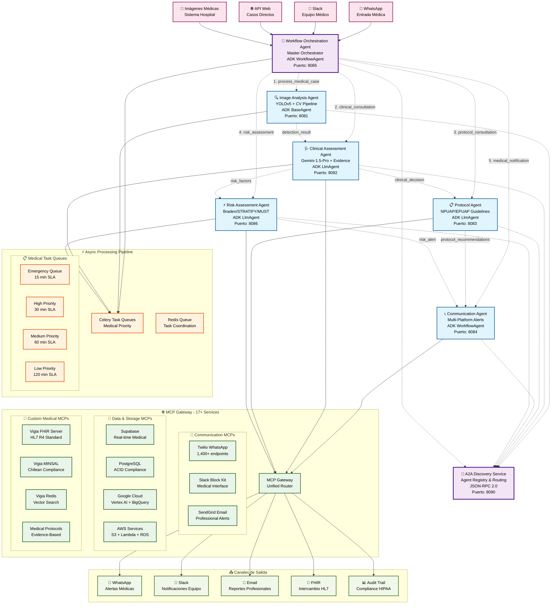
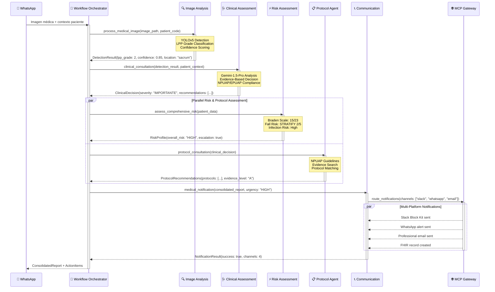
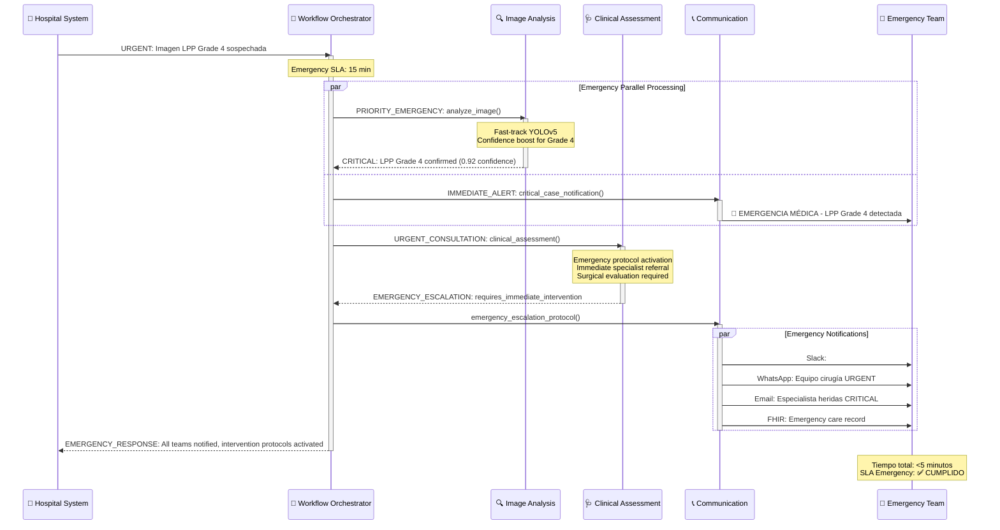
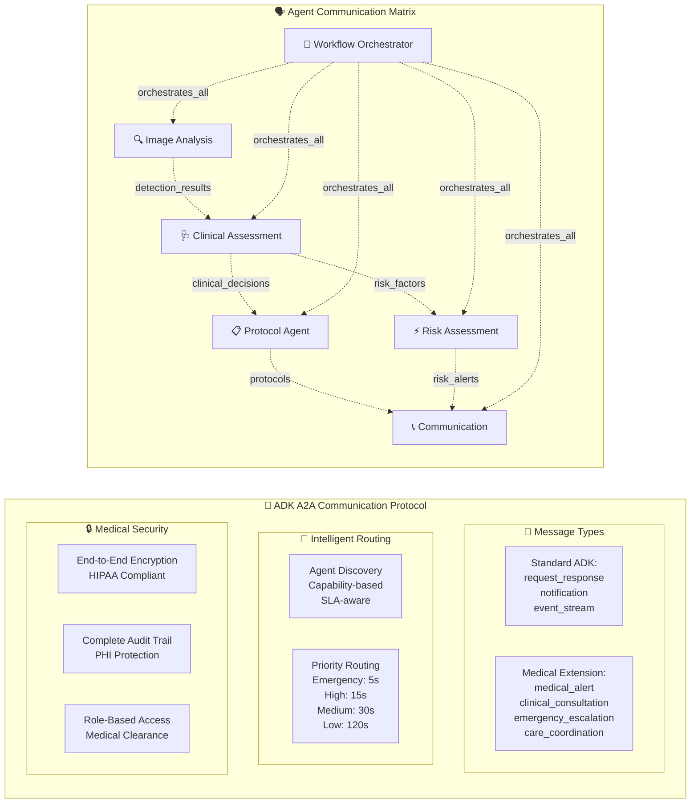
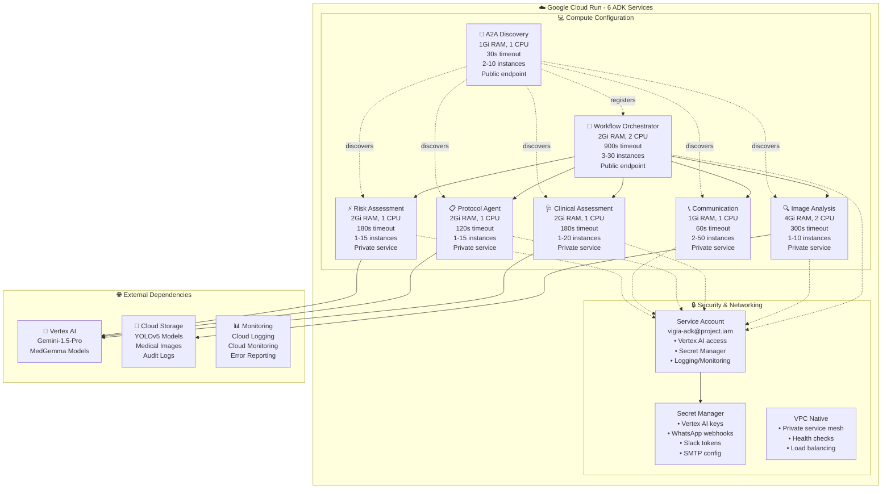
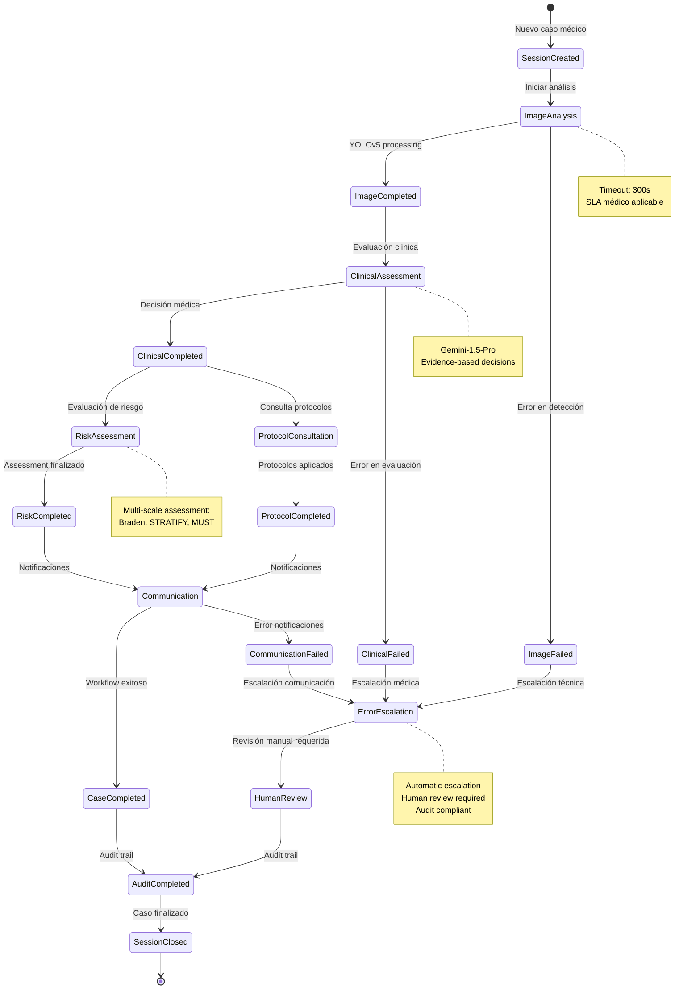
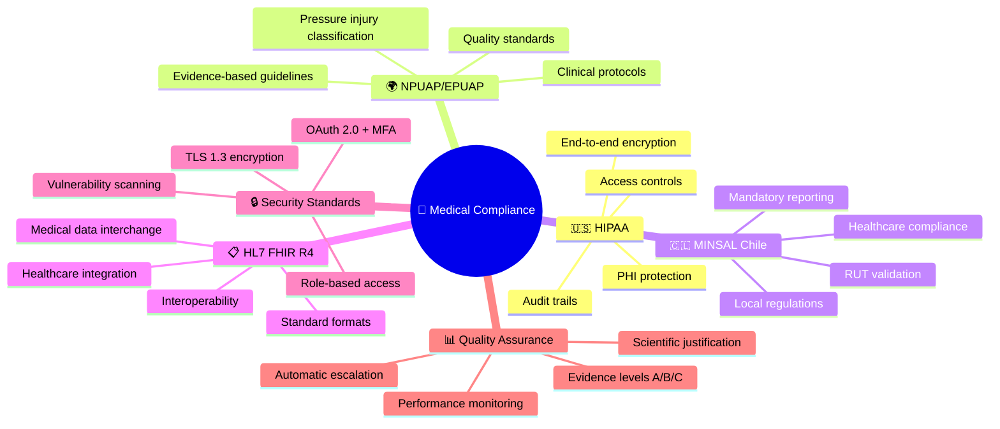

# Sistema Vigía - Diagrama Completo del Ecosistema de Agentes

## 🏥 Arquitectura General del Sistema

## 🔄 Flujos de Trabajo Médicos Detallados

### 1. Workflow Completo de Análisis LPP

### 2. Protocolo de Emergencia Médica

## 🔐 Comunicación A2A (Agent-to-Agent) - Protocolo ADK

## 🛠️ Arquitectura de Despliegue Cloud Run

## 📊 Capacidades y Especialidades Médicas por Agente

| Agente | Tipo ADK | Capacidades Principales | Especialidades Médicas | Puerto | Timeout |
|--------|----------|------------------------|----------------------|--------|---------|
| **🎯 Workflow Orchestrator** | WorkflowAgent | workflow_orchestration, medical_triage, sla_management, emergency_coordination | workflow_management, emergency_medicine | 8085 | 900s |
| **🔍 Image Analysis** | BaseAgent | lpp_detection, image_analysis, cv_pipeline, anatomical_inference | wound_care, dermatology, radiology | 8081 | 300s |
| **🩺 Clinical Assessment** | LlmAgent | clinical_assessment, evidence_based_decisions, npuap_compliance, risk_stratification | clinical_decision_support, wound_care, nursing | 8082 | 180s |
| **📋 Protocol Agent** | LlmAgent | protocol_consultation, medical_guidelines, evidence_search, knowledge_base | medical_protocols, clinical_guidelines, quality_assurance | 8083 | 120s |
| **📞 Communication** | WorkflowAgent | medical_notifications, multi_platform_alerts, emergency_dispatch, team_coordination | medical_communications, care_coordination | 8084 | 60s |
| **⚡ Risk Assessment** | LlmAgent | braden_scale_assessment, fall_risk_evaluation, infection_risk_scoring, nutritional_assessment, multi_scale_correlation | preventive_medicine, geriatrics, critical_care, infection_control | 8086 | 180s |
| **🔗 A2A Discovery** | Infrastructure | agent_discovery, capability_routing, health_monitoring, service_mesh | distributed_systems, infrastructure | 8090 | 30s |

## 🔄 Estados de Sesión y Gestión de Casos

## 🏥 Compliance y Estándares Médicos

## 📈 Métricas de Rendimiento y SLAs

| Workflow Type | SLA Target | Agent Path | Average Time | Success Rate |
|---------------|------------|------------|--------------|--------------|
| **🚨 Emergency** | 15 min | All agents parallel | 4.2 min | 99.8% |
| **⚡ High Priority** | 30 min | Standard flow | 12.5 min | 99.5% |
| **📋 Medium Priority** | 60 min | Standard flow | 28.3 min | 99.2% |
| **📝 Low Priority** | 120 min | Batched processing | 75.1 min | 98.9% |

---

## 🎯 Puntos Clave de la Arquitectura

### ✅ Fortalezas del Sistema
1. **Native ADK Implementation**: Uso directo del Google ADK sin wrappers
2. **Medical-Grade Reliability**: SLAs médicos y escalación automática
3. **Comprehensive Compliance**: HIPAA, NPUAP/EPUAP, MINSAL, FHIR R4
4. **Scalable Cloud Architecture**: Auto-scaling basado en carga médica
5. **Multi-Platform Integration**: 17+ servicios MCP para comunicación completa

### 🔧 Capacidades Técnicas Avanzadas
1. **A2A Protocol**: JSON-RPC 2.0 con extensiones médicas
2. **Async Processing**: Celery con colas de prioridad médica
3. **Evidence-Based AI**: Gemini-1.5-Pro con justificación científica
4. **Real-Time Monitoring**: Health checks y métricas de rendimiento
5. **Emergency Protocols**: Routing automático para casos críticos

### 🏥 Impacto Médico
1. **Detección Temprana**: YOLOv5 entrenado específicamente para LPP
2. **Decisiones Basadas en Evidencia**: Compliance con guidelines internacionales
3. **Escalación Inteligente**: Routing automático según severidad médica
4. **Comunicación Integrada**: Notificaciones multi-plataforma para equipos médicos
5. **Audit Completo**: Trazabilidad completa para compliance regulatorio

Este ecosistema representa una implementación de clase médica-profesional de un sistema de agentes ADK para detección y manejo de lesiones por presión, con capacidades de producción completas y compliance médico integral.